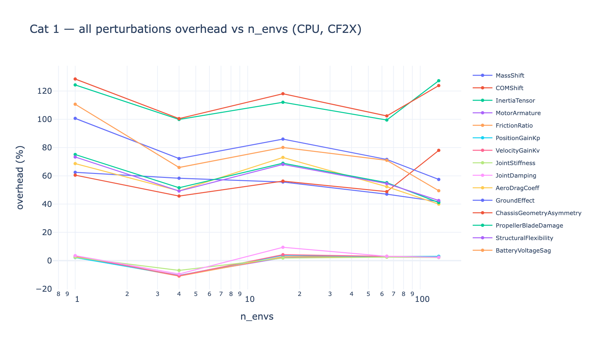
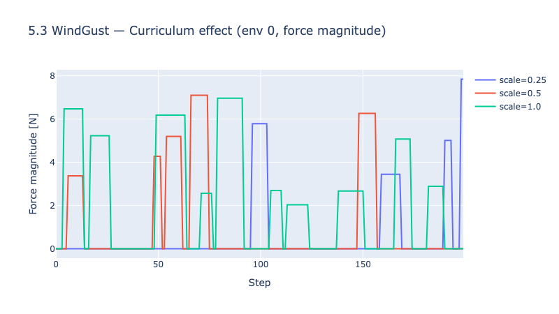
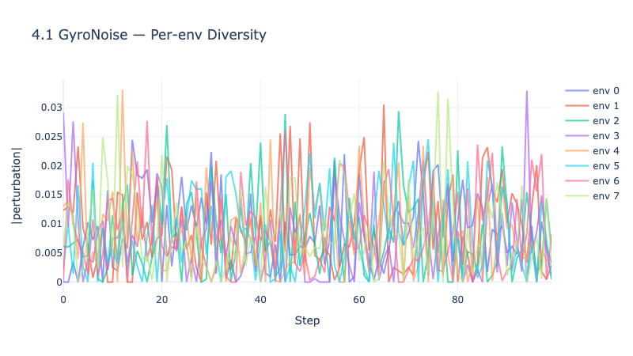

# genesis-robust-rl

**Robust reinforcement learning for quadrotor drones on the [Genesis](https://github.com/Genesis-Embodied-AI/Genesis) simulator — domain randomization and adversarial training at scale.**

[](https://github.com/Paul-antoineLeTolguenec/genesis-robust-quadrotor/actions/workflows/ci.yml)


---

## Overview

Training policies that transfer from simulation to reality is the central unsolved problem in drone RL. `genesis-robust-rl` provides a **structured perturbation engine** and **adversarial training API** to make this transfer more reliable — all GPU-batched on top of the Genesis simulator.

### Key features

- **69 perturbations across 8 categories** — physics, motors, temporal delays, sensors, wind, actions, payload, external disturbances
- **Three training modes** — Domain Randomization (DR), Robust Adversarial RL (RARL, alternating), Robust Adversarial Play (RAP, joint)
- **Gymnasium-compatible** — drop-in replacement for any Gym-based RL stack
- **Lipschitz-continuous adversary** — bounded per-step variation for stable training
- **Curriculum scheduling** — progressive difficulty via linear / cosine / step schedules
- **< 5% overhead** — perturbation logic measured against fixed-tensor baseline with real Crazyflie CF2X

---

## Showcase

### Hover under nominal conditions vs wind disturbances

| Baseline (no perturbations) | Perturbed (WindGust active) |
|:---:|:---:|
|  |  |

Regenerate these demos with the scripts under [`docs/media/`](docs/media/).

### Overhead stays under 5% — validated on real Crazyflie CF2X



### Curriculum progressively increases perturbation strength



### Per-environment diversity for GPU-batched training



### Performance scaling with environment count


---

## Quickstart

### Install

```bash
git clone https://github.com/Paul-antoineLeTolguenec/genesis-robust-quadrotor.git
cd genesis-robust-quadrotor
uv sync --extra dev
```

### Minimal training example

```python
from genesis_robust_rl.envs import RobustDroneEnv, AdversarialEnv, EnvConfig
from genesis_robust_rl.adversarial import PPOAgent, train

config = EnvConfig(
    n_envs=16,
    perturbation_ids=["mass_shift", "wind_gust", "gyro_noise"],
    mode="adversarial",
)

env = RobustDroneEnv(config)
adv_env = AdversarialEnv(env)

protagonist = PPOAgent(obs_dim=env.observation_space.shape[0],
                      action_dim=env.action_space.shape[0])
adversary = PPOAgent(obs_dim=env.privileged_obs_dim,
                     action_dim=adv_env.adversary_action_dim)

train(adv_env, protagonist, adversary, mode="rarl", total_steps=1_000_000)
```

### Run tests

```bash
uv run pytest                                         # Unit + integration (CPU only)
uv run pytest -m genesis                              # Genesis-dependent tests (local only)
uv run pytest tests/integration/test_overhead_genesis.py -v -s  # P6 overhead
```

---

## Architecture

```
                    +-----------------+
                    |  adversarial/   |
                    | (training loop, |
                    |  PPO, curriculum)|
                    +--------+--------+
                             |
                             v
                    +-----------------+
                    |     envs/       |
                    | (RobustDroneEnv,|
                    |  AdversarialEnv)|
                    +--------+--------+
                             |
                    +--------+--------+
                    |                 |
                    v                 v
          +-----------------+  +-----------------+
          | perturbations/  |  | sensor_models.py|
          | (base + 8 cats) |  | (6 fwd models)  |
          +-----------------+  +-----------------+
                    |
                    v
          +-----------------+
          |    Genesis API  |
          | (scene, solver) |
          +-----------------+
```

See [`.agents/knowledge/architecture.md`](.agents/knowledge/architecture.md) for the full module graph, data flow, and design patterns.

---

## Documentation

| Area | Entry point |
|------|-------------|
| Project status | [`ROADMAP.md`](ROADMAP.md) |
| Agent knowledge base (LLM-friendly) | [`AGENTS.md`](AGENTS.md) + [`.agents/knowledge/`](.agents/knowledge/) |
| Genesis feasibility study | [`docs/00_feasibility.md`](docs/00_feasibility.md) |
| Sensor forward models | [`docs/00b_sensor_models.md`](docs/00b_sensor_models.md) |
| Perturbation catalog (69 entries) | [`docs/01_perturbations_catalog.md`](docs/01_perturbations_catalog.md) |
| Class design | [`docs/02_class_design.md`](docs/02_class_design.md) |
| Gym + adversarial API | [`docs/03_api_design.md`](docs/03_api_design.md) |
| Component interactions | [`docs/04_interactions.md`](docs/04_interactions.md) |
| Test conventions | [`docs/05_test_conventions.md`](docs/05_test_conventions.md) |
| Adversarial training design | [`docs/07_adversarial_training.md`](docs/07_adversarial_training.md) |
| Per-perturbation docs + plots | [`docs/impl/`](docs/impl/) |

---

## Project status

**Current phase: 6 — Documentation & Release.** Phases 0–5 complete: setup, design, perturbation engine (69/69), base Gymnasium environment, adversarial wrapper, robust RL training loop (DR/RARL/RAP). See [`ROADMAP.md`](ROADMAP.md) for the full timeline.

---

## Citation

```bibtex
@software{genesis_robust_rl,
  author  = {Le Tolguenec, Paul-Antoine},
  title   = {genesis-robust-rl: Robust Reinforcement Learning for Quadrotors on Genesis},
  year    = {2026},
  url     = {https://github.com/Paul-antoineLeTolguenec/genesis-robust-quadrotor}
}
```

## License

License to be determined. Contact the author for usage terms in the meantime.
