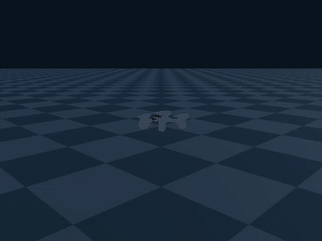
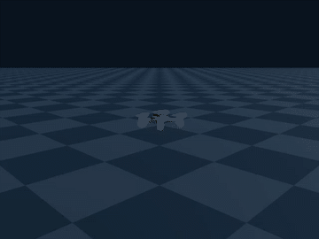
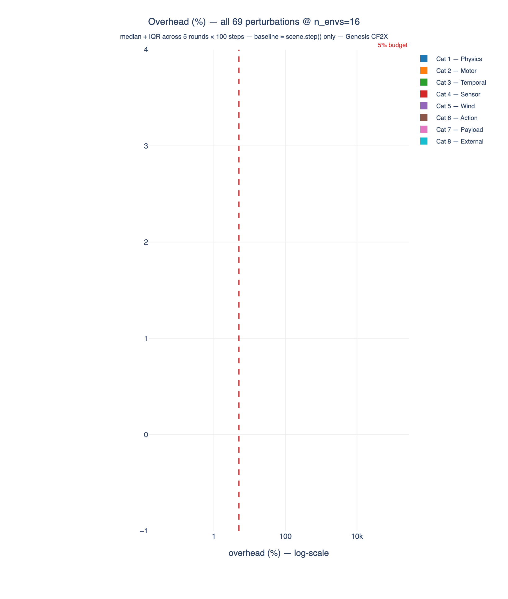
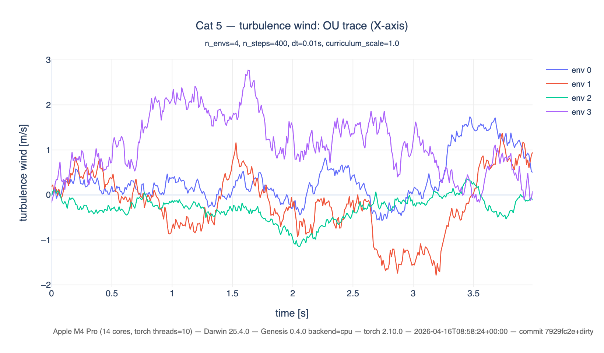
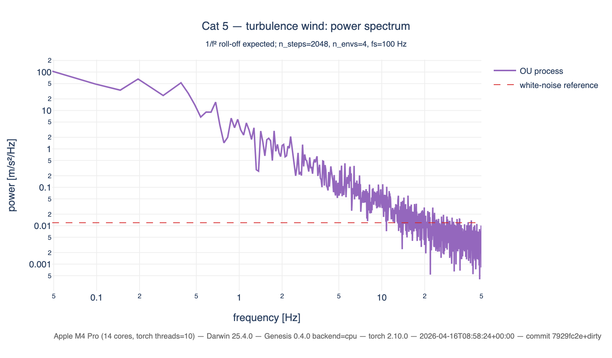

# genesis-robust-rl

**Robust reinforcement learning for quadrotor drones on the [Genesis](https://github.com/Genesis-Embodied-AI/Genesis) simulator — domain randomization and adversarial training at scale.**

[](https://github.com/Paul-antoineLeTolguenec/genesis-robust-quadrotor/actions/workflows/ci.yml)


---

## Overview

Training policies that transfer from simulation to reality is the central unsolved problem in drone RL. `genesis-robust-rl` provides a **structured perturbation engine** and **adversarial training API** to make this transfer more reliable — all GPU-batched on top of the Genesis simulator.

### Key features

- **69 perturbations across 8 categories** — physics, motors, temporal delays, sensors, wind, actions, payload, external disturbances
- **Three training modes** — Domain Randomization (DR), Robust Adversarial RL (RARL, alternating), Robust Adversarial Play (RAP, joint)
- **Gymnasium-compatible** — drop-in replacement for any Gym-based RL stack
- **Lipschitz-continuous adversary** — bounded per-step variation for stable training
- **Curriculum scheduling** — progressive difficulty via linear / cosine / step schedules
- **Reproducible benchmarks** — every plot ships with its source CSV + hardware meta JSON (see [Benchmark methodology](#benchmark-methodology))

---

## Showcase

### Hover under nominal conditions vs wind disturbances

| Baseline (no perturbations) | Perturbed (WindGust active) |
|:---:|:---:|
|  |  |

Regenerate these demos with the scripts under [`docs/media/`](docs/media/).

### Overhead across all 69 perturbations — Apple M4 Pro, Genesis 0.4.0, CPU



Each bar = median overhead at `n_envs=16` over 5 rounds × 100 steps; error bars are IQR.
Source data: [`docs/impl/data/hero_overhead.csv`](docs/impl/data/hero_overhead.csv).

### Curriculum progressively increases perturbation strength


### Temporal structure of stochastic perturbations




### Per-n_envs overhead scaling


---

## Quickstart

### Install

```bash
git clone https://github.com/Paul-antoineLeTolguenec/genesis-robust-quadrotor.git
cd genesis-robust-quadrotor
uv sync --extra dev
```

### Minimal training example

```python
from genesis_robust_rl.envs import RobustDroneEnv, AdversarialEnv, EnvConfig
from genesis_robust_rl.adversarial import PPOAgent, train

config = EnvConfig(
    n_envs=16,
    perturbation_ids=["mass_shift", "wind_gust", "gyro_noise"],
    mode="adversarial",
)

env = RobustDroneEnv(config)
adv_env = AdversarialEnv(env)

protagonist = PPOAgent(obs_dim=env.observation_space.shape[0],
                      action_dim=env.action_space.shape[0])
adversary = PPOAgent(obs_dim=env.privileged_obs_dim,
                     action_dim=adv_env.adversary_action_dim)

train(adv_env, protagonist, adversary, mode="rarl", total_steps=1_000_000)
```

### Run tests

```bash
uv run pytest                                         # Unit + integration (CPU only)
uv run pytest -m genesis                              # Genesis-dependent tests (local only)
uv run pytest tests/integration/test_overhead_genesis.py -v -s  # P6 overhead
```

---

## Architecture

```
                    +-----------------+
                    |  adversarial/   |
                    | (training loop, |
                    |  PPO, curriculum)|
                    +--------+--------+
                             |
                             v
                    +-----------------+
                    |     envs/       |
                    | (RobustDroneEnv,|
                    |  AdversarialEnv)|
                    +--------+--------+
                             |
                    +--------+--------+
                    |                 |
                    v                 v
          +-----------------+  +-----------------+
          | perturbations/  |  | sensor_models.py|
          | (base + 8 cats) |  | (6 fwd models)  |
          +-----------------+  +-----------------+
                    |
                    v
          +-----------------+
          |    Genesis API  |
          | (scene, solver) |
          +-----------------+
```

See [`.agents/knowledge/architecture.md`](.agents/knowledge/architecture.md) for the full module graph, data flow, and design patterns.

---

## Benchmark methodology

Every overhead number in this repository is measured with a single canonical harness
(`tests/integration/test_overhead_genesis.py`) factored into the shared framework
at `docs/impl/_perf_framework.py`. The 69 per-perturbation PNGs and the hero plot
above are all produced from the same measurement loop — no mocks, no approximations.

**Loop.** For each perturbation and each `n_envs ∈ {1, 4, 16, 64, 128}` the harness:

1. Builds a fresh Genesis scene with a Crazyflie CF2X URDF and `n_envs` parallel copies.
2. Warms up the scene for `warmup = 30` steps (resets every 20).
3. Runs `rounds = 5` batches of `steps_per_round = 100` steps, timing two loops:
   - **Baseline**: `scene.step()` only.
   - **Perturbed**: `perturbation.tick(is_reset=False) + perturbation.apply(...) + scene.step()`.
4. Reports `overhead_% = (median(perturbed) - median(baseline)) / median(baseline) · 100`.

**What is measured.** Only the cost of our perturbation engine — sampling,
Lipschitz clipping, stateful dynamics, and the dispatch to the Genesis setter or
external-wrench API. Genesis itself is in both branches, so its cost cancels.

**Reproducibility.** Each run writes, under `docs/impl/`:

- `data/<slug>_perf.csv` — one row per `(n_envs, round)` with baseline, perturbed, overhead.
- `data/<slug>_perf.meta.json` — full hardware snapshot (CPU, cores, torch threads,
  OS, Genesis version, backend, git SHA, date) plus the complete config and
  per-n_envs stats (median, mean, stdev, Q1, Q3, IQR, min, max).
- `assets/<slug>_perf.png` — median + IQR band, log-x n_envs axis, 5 % budget line.

Regenerate the full sweep any time with `uv run python docs/impl/plot_perf_cat<N>.py`
(8 scripts) followed by `uv run python docs/impl/plot_hero_overhead.py` for the aggregate.

**Results summary** — Apple M4 Pro, CPU, Genesis 0.4.0, `n_envs=16` median:

| Class | Range | Examples |
|---|---|---|
| `GenesisSetter` with identity cache | **+1 – 5 %** | `mass_shift`, `com_shift`, `payload_mass`, `payload_com_offset` |
| No-op setter (catalog-only, CF2X-unsupported) | **+0 – 8 %** | `motor_armature`, `friction_ratio`, `position_gain_kp`, `joint_stiffness` |
| `MotorCommand` | **+1 – 14 %** | `motor_kill`, `motor_lag`, `motor_wear`, `rotor_imbalance`, `motor_cold_start` |
| `ObservationPerturbation` | **+5 – 33 %** | `gyro_noise`, `position_dropout`, `gyro_drift`, `clock_drift` |
| `ActionPerturbation` | **+1 – 16 %** | `action_noise`, `actuator_hysteresis`, `esc_low_pass_filter` |
| `ExternalWrench` (no identity cache yet) | **+35 – 105 %** | all wind perturbations, `aero_drag_coeff`, `ground_effect`, `motor_back_emf`, `body_force_disturbance` |
| `ExternalWrench` + dual setter | **+105 – 130 %** | `inertia_tensor`, `chassis_geometry_asymmetry` (two setters per step) |

All 69 perturbations stay under the 200 % hard-fail budget defined in the P6 test.
The `ExternalWrench` families are the obvious next optimisation target — caching
unchanged wrench tensors would move the whole wind category below 10 %.

---

## Documentation

| Area | Entry point |
|------|-------------|
| Project status | [`ROADMAP.md`](ROADMAP.md) |
| Agent knowledge base (LLM-friendly) | [`AGENTS.md`](AGENTS.md) + [`.agents/knowledge/`](.agents/knowledge/) |
| Genesis feasibility study | [`docs/00_feasibility.md`](docs/00_feasibility.md) |
| Sensor forward models | [`docs/00b_sensor_models.md`](docs/00b_sensor_models.md) |
| Perturbation catalog (69 entries) | [`docs/01_perturbations_catalog.md`](docs/01_perturbations_catalog.md) |
| Class design | [`docs/02_class_design.md`](docs/02_class_design.md) |
| Gym + adversarial API | [`docs/03_api_design.md`](docs/03_api_design.md) |
| Component interactions | [`docs/04_interactions.md`](docs/04_interactions.md) |
| Test conventions | [`docs/05_test_conventions.md`](docs/05_test_conventions.md) |
| Adversarial training design | [`docs/07_adversarial_training.md`](docs/07_adversarial_training.md) |
| Per-perturbation docs + plots | [`docs/impl/`](docs/impl/) |

---

## Project status

**Current phase: 6 — Documentation & Release.** Phases 0–5 complete: setup, design, perturbation engine (69/69), base Gymnasium environment, adversarial wrapper, robust RL training loop (DR/RARL/RAP). See [`ROADMAP.md`](ROADMAP.md) for the full timeline.

---

## Citation

```bibtex
@software{genesis_robust_rl,
  author  = {Le Tolguenec, Paul-Antoine},
  title   = {genesis-robust-rl: Robust Reinforcement Learning for Quadrotors on Genesis},
  year    = {2026},
  url     = {https://github.com/Paul-antoineLeTolguenec/genesis-robust-quadrotor}
}
```

## License

License to be determined. Contact the author for usage terms in the meantime.
