# Robot Physical Dynamics Perturbations

> Technical reference for implemented perturbations in category 1.
> Source: `src/genesis_robust_rl/perturbations/category_1_physics.py`
> Plots generated by: `docs/impl/plot_category_1.py`

---

## 1.1 MassShift

### Description

Perturbs the drone body mass by adding a scalar shift Δm [kg] to the nominal mass.
Applied via `drone.set_links_mass_shift(Δm, envs_idx)` — a Genesis native setter that
operates per-env and per-step without triggering recompilation.

**Hook timing:** called at env step [6] after `scene.step()` (post_physics¹).
The setter takes effect at the **next** `scene.step()` — semantically pre-physics for the next step.

---

### Formal definition

Let $m_\text{nom}$ be the nominal drone body mass.

The perturbed mass at episode $k$ for environment $i$ is:

$$
m_i^{(k)} = m_\text{nom} + \Delta m_i^{(k)}
$$

where $\Delta m_i^{(k)}$ is independently sampled per env and per episode:

$$
\Delta m_i^{(k)} \sim \mathcal{D}(\theta) \cdot s + (1 - s) \cdot 0
\quad \text{clipped to } [b_\text{min},\, b_\text{max}]
$$

- $\mathcal{D}(\theta)$: configured distribution (uniform or gaussian)
- $s \in [0, 1]$: `curriculum_scale` — intensity multiplier
- $b_\text{min}, b_\text{max}$: hard bounds

Equivalently, with `curriculum_scale` formula:

$$
\Delta m = 0 + (\text{raw} - 0) \times s = \text{raw} \times s, \quad \text{raw} \sim \mathcal{D}(\theta)
$$

**Default config:** $\mathcal{D} = \text{Uniform}(-0.05,\, 0.1)\ \text{kg}$,
bounds $[-0.5,\, 1.0]\ \text{kg}$, `frequency="per_episode"`.

---

### Parameters

| Parameter | Type | Default | Description |
|---|---|---|---|
| `distribution` | str | `"uniform"` | `"uniform"` or `"gaussian"` |
| `distribution_params` | dict | `{"low": -0.05, "high": 0.1}` | Distribution parameters |
| `bounds` | tuple[float, float] | `(-0.5, 1.0)` | Hard physical bounds [kg] |
| `nominal` | float | `0.0` | Unperturbed mass shift [kg] |
| `frequency` | str | `"per_episode"` | Resampling frequency |
| `scope` | str | `"per_env"` | Always per-env (independent DR) |
| `lipschitz_k` | float\|None | `None` | Max \|Δm\| per step in adversarial mode |
| `observable` | bool | `True` | Expose Δm in privileged obs vector |

---

### Catalog reference

| Field | Value |
|---|---|
| `id` | `mass_shift` |
| `catalog_ref` | 1.1 |
| `stateful` | no |
| `application_hook` | post_physics¹ |
| `implementation` | `genesis_api` — `set_links_mass_shift()` |
| `feasibility_ref` | §2 |
| `risk` | low |
| `priority` | 1 |

---

### Curriculum scale effect

The plot below shows how `curriculum_scale` ∈ {0.0, 0.5, 1.0} modifies the effective
sampling distribution of Δm for `Uniform(-0.05, 0.1)`.

- `scale=0.0` → all samples collapse to `nominal = 0.0 kg` (no perturbation)
- `scale=0.5` → range halved: `Uniform(-0.025, 0.05)`
- `scale=1.0` → full range: `Uniform(-0.05, 0.1)`

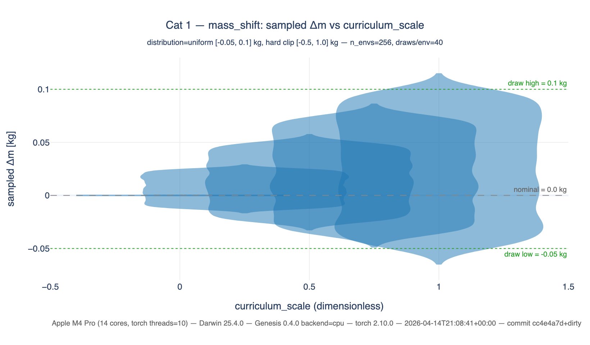

---

### Per-env diversity

In domain randomization mode (`frequency="per_episode"`), each environment independently
resamples Δm at every episode reset, creating diverse training conditions across the batch.

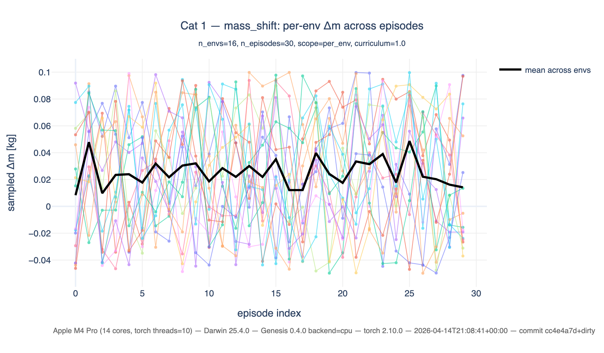

---

### Usage

```python
from genesis_robust_rl.perturbations.category_1_physics import MassShift

mass_shift = MassShift(
    setter_fn=drone.set_links_mass_shift,
    n_envs=512,
    dt=0.01,
    distribution="uniform",
    distribution_params={"low": -0.05, "high": 0.1},
    bounds=(-0.5, 1.0),
    curriculum_scale=1.0,
)

# Domain randomization — called by env loop
mass_shift.tick(is_reset=True)        # episode start: samples Δm per env
mass_shift.apply(scene, drone, state) # injects into Genesis

# Adversarial — adversary sets values
mass_shift.mode = PerturbationMode.ADVERSARIAL
mass_shift.set_value(delta_m_tensor)  # Lipschitz-clipped if lipschitz_k set
```

---

### Performance overhead vs n_envs

Measured with real Genesis Crazyflie CF2X (n_envs=16, median of 5 rounds × 100 steps).
P6 integration test: FAIL >200%, WARNING >100%.
Enforced by `tests/integration/test_overhead_genesis.py`.

| Metric | Value |
|---|---|
| Overhead (n_envs=16) | +2.6% ✅ |
| P6 status | PASS |

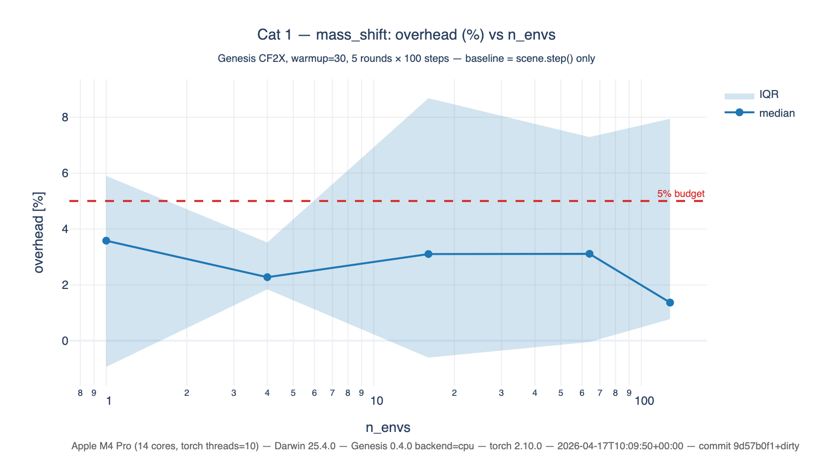

> Regenerate: `uv run python docs/impl/plot_category_1_overhead.py`

---

### Genesis API note

`set_links_mass_shift()` requires `batch_links_info=True` in `RigidOptions` at scene build time.
Verified feasible in Genesis v0.3.14 (see `docs/00_feasibility.md §2`).

---

## 1.2 COMShift

### Description

Perturbs the drone center-of-mass position by adding a 3D vector Δr [m] to the nominal CoM.
Applied via `drone.set_links_COM_shift(Δr, envs_idx)` — a Genesis native setter operating
per-env and per-step without triggering recompilation.

**Hook timing:** called at env step [6] after `scene.step()` (post_physics¹).
The setter takes effect at the **next** `scene.step()` — semantically pre-physics for the next step.

---

### Formal definition

Let $r_\text{nom}$ be the nominal CoM position in link frame.

The perturbed CoM at episode $k$ for environment $i$ is:

$$
r_i^{(k)} = r_\text{nom} + \Delta r_i^{(k)}
$$

where $\Delta r_i^{(k)} \in \mathbb{R}^3$ is independently sampled per env and per episode:

$$
\Delta r_i^{(k)} \sim \mathcal{D}(\theta) \cdot s + (1 - s) \cdot \mathbf{0}
\quad \text{clipped component-wise to } [b_\text{min},\, b_\text{max}]
$$

- $\mathcal{D}(\theta)$: configured distribution (uniform or gaussian), applied identically to all 3 axes
- $s \in [0, 1]$: `curriculum_scale` — intensity multiplier
- $b_\text{min}, b_\text{max}$: hard bounds per axis

**Default config:** $\mathcal{D} = \text{Uniform}(-0.02,\, 0.02)\ \text{m}$,
bounds $[-0.05,\, 0.05]\ \text{m}$, `frequency="per_episode"`.

---

### Parameters

| Parameter | Type | Default | Description |
|---|---|---|---|
| `distribution` | str | `"uniform"` | `"uniform"` or `"gaussian"` |
| `distribution_params` | dict | `{"low": -0.02, "high": 0.02}` | Distribution parameters |
| `bounds` | tuple[float, float] | `(-0.05, 0.05)` | Hard physical bounds per axis [m] |
| `nominal` | list[float] | `[0.0, 0.0, 0.0]` | Unperturbed CoM shift [m] |
| `frequency` | str | `"per_episode"` | Resampling frequency |
| `scope` | str | `"per_env"` | Always per-env (independent DR) |
| `lipschitz_k` | float\|None | `None` | Max ‖Δr‖ per step in adversarial mode |
| `observable` | bool | `True` | Expose Δr in privileged obs vector |

---

### Catalog reference

| Field | Value |
|---|---|
| `id` | `com_shift` |
| `catalog_ref` | 1.2 |
| `stateful` | no |
| `application_hook` | post_physics¹ |
| `implementation` | `genesis_api` — `set_links_COM_shift()` |
| `feasibility_ref` | §2 |
| `risk` | low |
| `priority` | 1 |

---

### Curriculum scale effect

The plot below shows how `curriculum_scale` ∈ {0.0, 0.5, 1.0} modifies the effective
sampling distribution of Δr (x-axis shown) for `Uniform(-0.02, 0.02)`.

- `scale=0.0` → all samples collapse to `nominal = 0.0 m` (no perturbation)
- `scale=0.5` → range halved: `Uniform(-0.01, 0.01)`
- `scale=1.0` → full range: `Uniform(-0.02, 0.02)`

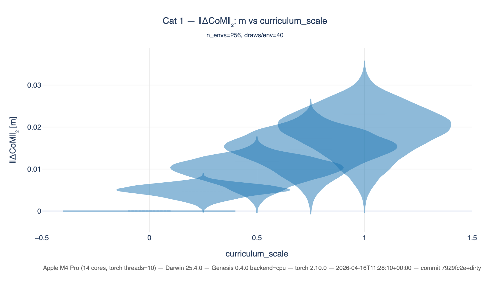

---

### Per-env diversity

In domain randomization mode (`frequency="per_episode"`), each environment independently
resamples Δr at every episode reset, creating diverse 3D CoM offsets across the batch.

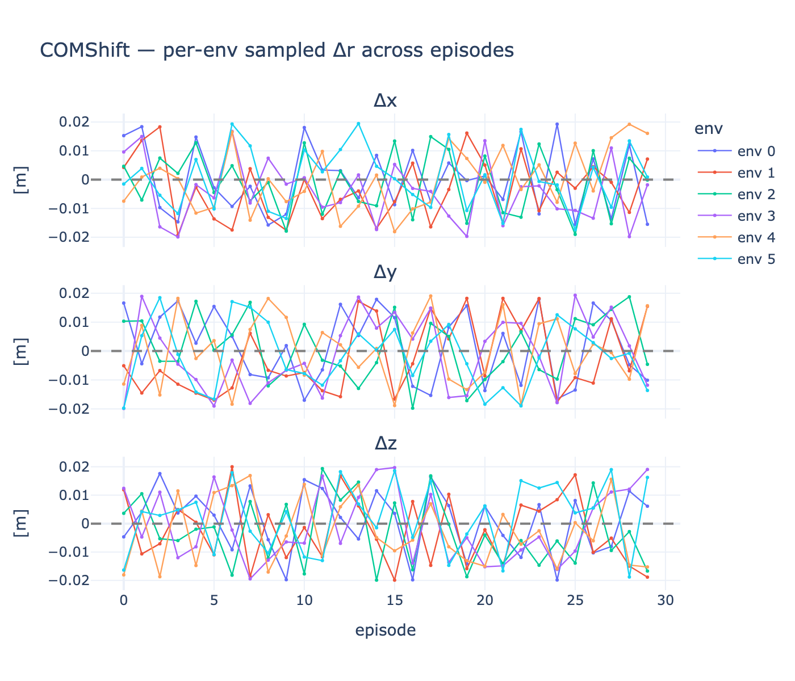

---

### Usage

```python
from genesis_robust_rl.perturbations.category_1_physics import COMShift

com_shift = COMShift(
    setter_fn=drone.set_links_COM_shift,
    n_envs=512,
    dt=0.01,
    distribution="uniform",
    distribution_params={"low": -0.02, "high": 0.02},
    bounds=(-0.05, 0.05),
    curriculum_scale=1.0,
)

# Domain randomization — called by env loop
com_shift.tick(is_reset=True)        # episode start: samples Δr per env
com_shift.apply(scene, drone, state) # injects into Genesis

# Adversarial — adversary sets values
com_shift.mode = PerturbationMode.ADVERSARIAL
com_shift.set_value(delta_r_tensor)  # Lipschitz-clipped if lipschitz_k set
```

---

### Performance overhead vs n_envs

Measured with real Genesis Crazyflie CF2X (n_envs=16, median of 5 rounds × 100 steps).
P6 integration test: FAIL >200%, WARNING >100%.
Enforced by `tests/integration/test_overhead_genesis.py`.

| Metric | Value |
|---|---|
| Overhead (n_envs=16) | +1.7% ✅ |
| P6 status | PASS |

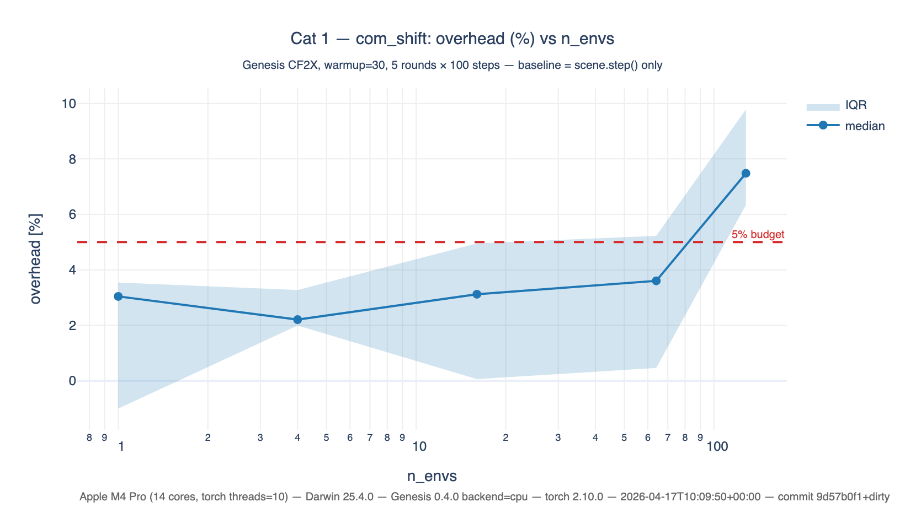

> Regenerate: `uv run python docs/impl/plot_category_1_overhead.py`

---

### Genesis API note

`set_links_COM_shift()` requires `batch_links_info=True` in `RigidOptions` at scene build time.
Verified feasible in Genesis v0.3.14 (see `docs/00_feasibility.md §2`).

---

## 1.3 InertiaTensor

### Description

Perturbs the drone inertia tensor by applying a per-axis multiplicative scale $s \in \mathbb{R}^3$.
Genesis v0.3.14 has no direct inertia setter — the perturbation is approximated via the
**parallel-axis (Huygens-Steiner) theorem**: scaling $I_j$ by $s_j$ is achieved by jointly
adjusting the mass shift and the CoM arm along each axis.

**Hook timing:** called at `reset` — per_episode only.
Both `set_links_mass_shift` and `set_links_COM_shift` are called together in a single `apply()`.

---

### Formal definition

Let $m_\text{nom}$ be the nominal body mass and $r_{\text{nom},j}$ the nominal radius of gyration
for axis $j \in \{x, y, z\}$.

The nominal inertia for axis $j$ is $I_{\text{nom},j} = m_\text{nom} \cdot r_{\text{nom},j}^2$.
The target scaled inertia is $I_j^{(k)} = s_j^{(k)} \cdot I_{\text{nom},j}$.

Using Huygens-Steiner, the approximation injects:

$$
\Delta m_i = m_\text{nom} \cdot \left(\overline{s}_i - 1\right), \quad \overline{s}_i = \frac{1}{3}\sum_j s_{i,j}
$$

$$
\Delta r_{i,j} = r_{\text{nom},j} \cdot \left(\sqrt{s_{i,j}} - 1\right)
$$

where $s_{i,j}^{(k)} \in [s_\text{min}, s_\text{max}]$ is sampled independently per env $i$, per axis $j$, per episode $k$.

With `curriculum_scale` $c \in [0,1]$:

$$
s_{i,j} = 1 + (\text{raw}_{i,j} - 1) \times c, \quad \text{raw}_{i,j} \sim \mathcal{D}(\theta)
$$

**Default config:** $\mathcal{D} = \text{Uniform}(0.8, 1.2)$, bounds $[0.5, 1.5]$, `frequency="per_episode"`.

> **Approximation note (risk: medium):** this jointly perturbs both effective mass and effective
> CoM, providing a first-order approximation of inertia scaling. It does not account for
> off-diagonal inertia terms. The approximation is physically meaningful within $s \in [0.5, 1.5]$.

---

### Parameters

| Parameter | Type | Default | Description |
|---|---|---|---|
| `distribution` | str | `"uniform"` | `"uniform"` or `"gaussian"` |
| `distribution_params` | dict | `{"low": 0.8, "high": 1.2}` | Distribution parameters |
| `bounds` | tuple[float, float] | `(0.5, 1.5)` | Hard physical bounds per axis (scaling factor) |
| `nominal` | list[float] | `[1.0, 1.0, 1.0]` | Unperturbed scale (identity) |
| `m_nom` | float | `0.5` | Nominal body mass [kg] used for Δm computation |
| `r_nom` | list[float] | `[0.05, 0.05, 0.03]` | Nominal radii of gyration per axis [m] |
| `frequency` | str | `"per_episode"` | Resampling frequency (always per_episode) |
| `scope` | str | `"per_env"` | Always per-env (independent DR) |
| `lipschitz_k` | float\|None | `None` | Always None (per_episode only) |
| `observable` | bool | `True` | Expose scale vector in privileged obs vector |

---

### Catalog reference

| Field | Value |
|---|---|
| `id` | `inertia_tensor` |
| `catalog_ref` | 1.3 |
| `stateful` | no |
| `application_hook` | reset |
| `implementation` | `genesis_api` — approximated via `set_links_mass_shift` + `set_links_COM_shift` (Huygens-Steiner) |
| `feasibility_ref` | §2 |
| `risk` | medium — approximation only, no direct tensor setter |
| `priority` | 2 |

---

### Curriculum scale effect

The plot below shows how `curriculum_scale` ∈ {0.0, 0.5, 1.0} modifies the effective
sampling distribution of the x-axis scale for `Uniform(0.8, 1.2)`.

- `scale=0.0` → all samples collapse to `nominal = 1.0` (no perturbation)
- `scale=0.5` → range halved: `Uniform(0.9, 1.1)`
- `scale=1.0` → full range: `Uniform(0.8, 1.2)`

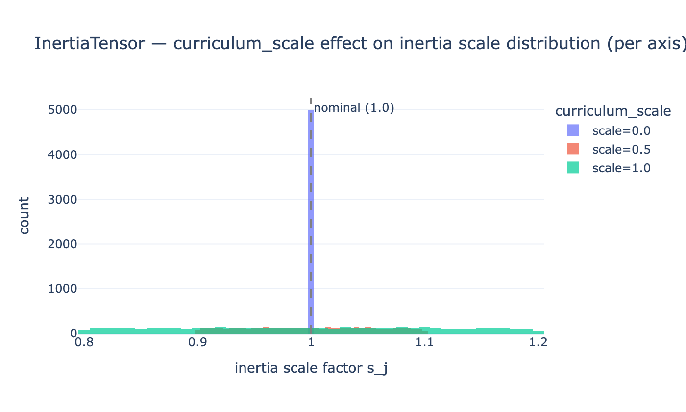

---

### Per-env diversity

In domain randomization mode, each environment independently resamples the 3-axis scale
vector at every episode reset, creating diverse inertia conditions across the batch.

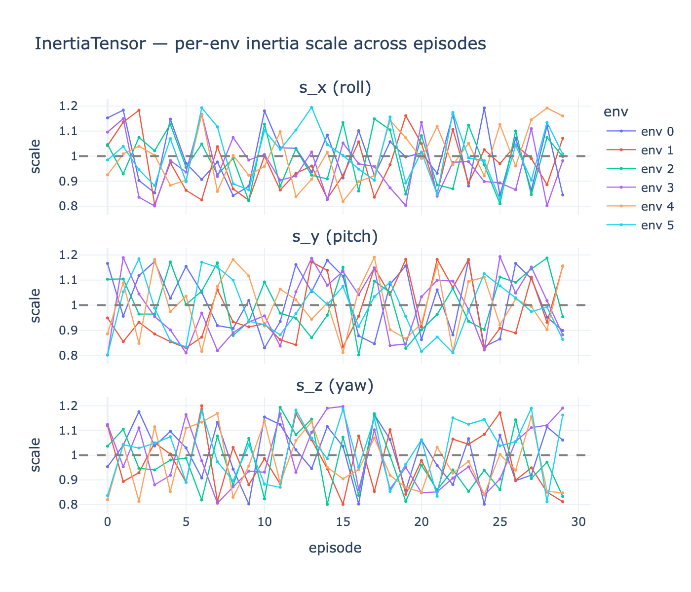

---

### Usage

```python
from genesis_robust_rl.perturbations.category_1_physics import InertiaTensor

inertia = InertiaTensor(
    mass_setter_fn=drone.set_links_mass_shift,
    com_setter_fn=drone.set_links_COM_shift,
    n_envs=512,
    dt=0.01,
    m_nom=0.5,
    r_nom=[0.05, 0.05, 0.03],
    distribution="uniform",
    distribution_params={"low": 0.8, "high": 1.2},
    bounds=(0.5, 1.5),
    curriculum_scale=1.0,
)

# Domain randomization — called at episode reset
inertia.tick(is_reset=True)        # samples scale per env
inertia.apply(scene, drone, state) # injects Δm + Δr into Genesis
```

---

### Performance overhead vs n_envs

Measured with real Genesis Crazyflie CF2X (n_envs=16, median of 5 rounds × 100 steps).
P6 integration test: FAIL >200%, WARNING >100%.
Enforced by `tests/integration/test_overhead_genesis.py`.

| Metric | Value |
|---|---|
| Overhead (n_envs=16) | +103% ⚠️ |
| P6 status | PASS (WARNING) |

> InertiaTensor requires both `set_links_mass_shift` + `set_links_COM_shift` calls,
> doubling the Genesis API cost. Overhead decreases with higher n_envs.

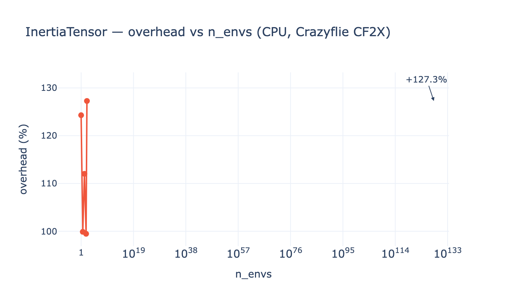

> Regenerate: `uv run python docs/impl/plot_category_1_overhead.py`

---

### Genesis API note

Both `set_links_mass_shift()` and `set_links_COM_shift()` require `batch_links_info=True`
in `RigidOptions` at scene build time.
Verified feasible in Genesis v0.3.14 (see `docs/00_feasibility.md §2`).

> **Approximation limitation:** Genesis v0.3.14 has no `set_links_inertia()` setter.
> This Huygens-Steiner approximation is the best available approach.
> A direct setter (if added in future Genesis versions) would replace both setter calls
> in `apply()` with a single `set_links_inertia(I_scaled, envs_idx)` call.

---

## 1.4 MotorArmature

### Description

Perturbs the rotor inertia (armature) of each DOF by applying a multiplicative scaling factor
to the nominal armature value. Applied via `drone.set_dofs_armature(value, envs_idx)`.

**Hook timing:** called at episode `reset` only — `set_dofs_armature()` triggers an expensive
physics recompute in Genesis and must never be called at every step.

**Risk note:** the recompute cost is absorbed at episode boundaries, which occur infrequently
relative to the step budget. The perturbation value (a scalar ratio) is sampled once per episode
per environment and injected immediately after `tick(is_reset=True)`.

---

### Formal definition

Let $a_\text{nom}$ be the nominal armature value per DOF.

The perturbed armature at episode $k$ for environment $i$ is:

$$
a_i^{(k)} = \alpha_i^{(k)} \cdot a_\text{nom}
$$

where $\alpha_i^{(k)}$ is a multiplicative scale sampled independently per env and per episode:

$$
\alpha_i^{(k)} \sim \mathcal{D}(\theta) \cdot c + (1 - c) \cdot 1
\quad \text{clipped to } [0.5,\, 1.5]
$$

- $\mathcal{D}(\theta)$: configured distribution (uniform or gaussian)
- $c \in [0, 1]$: `curriculum_scale` — intensity multiplier
- $[0.5, 1.5]$: bounds corresponding to $[0.5 \times a_\text{nom},\, 1.5 \times a_\text{nom}]$

With `curriculum_scale` formula:

$$
\alpha = 1 + (\text{raw} - 1) \times c, \quad \text{raw} \sim \mathcal{D}(\theta)
$$

**Default config:** $\mathcal{D} = \text{Uniform}(0.7, 1.3)$, bounds $[0.5, 1.5]$, `frequency="per_episode"`.

---

### Parameters

| Parameter | Type | Default | Description |
|---|---|---|---|
| `distribution` | str | `"uniform"` | `"uniform"` or `"gaussian"` |
| `distribution_params` | dict | `{"low": 0.7, "high": 1.3}` | Distribution parameters |
| `bounds` | tuple[float, float] | `(0.5, 1.5)` | Hard physical bounds (multiplicative ratio) |
| `nominal` | float | `1.0` | Unperturbed armature ratio (identity) |
| `frequency` | str | `"per_episode"` | Resampling frequency — always per_episode |
| `scope` | str | `"per_env"` | Always per-env (independent DR) |
| `lipschitz_k` | float\|None | `None` | Always None — per_episode setter only |
| `observable` | bool | `True` | Expose α in privileged obs vector |

---

### Catalog reference

| Field | Value |
|---|---|
| `id` | `motor_armature` |
| `catalog_ref` | 1.4 |
| `stateful` | no |
| `application_hook` | reset |
| `implementation` | `genesis_api` — `set_dofs_armature()` |
| `feasibility_ref` | §2 |
| `risk` | medium — expensive recompute, per-episode only |
| `priority` | 2 |

---

### Curriculum scale effect

The plot below shows how `curriculum_scale` ∈ {0.0, 0.5, 1.0} modifies the effective
sampling distribution of α for `Uniform(0.7, 1.3)`.

- `scale=0.0` → all samples collapse to `nominal = 1.0` (no perturbation)
- `scale=0.5` → range halved: `Uniform(0.85, 1.15)`
- `scale=1.0` → full range: `Uniform(0.7, 1.3)`

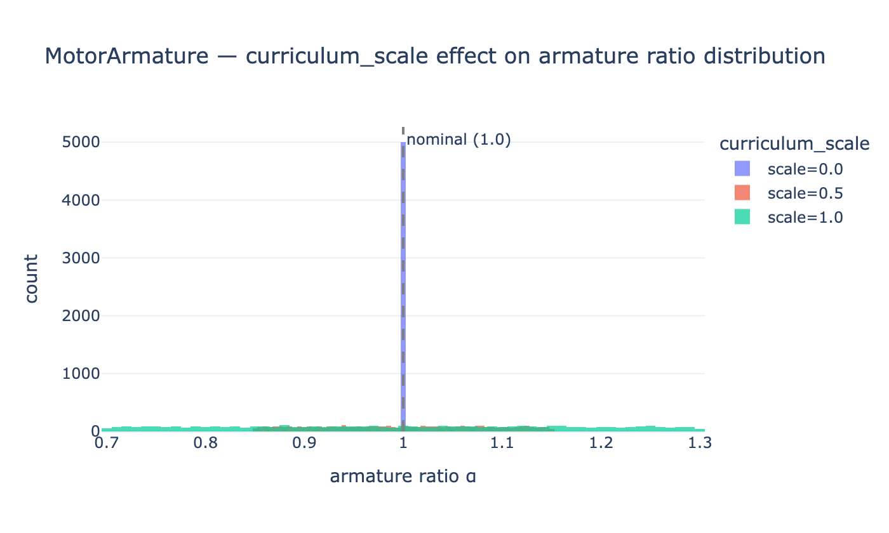

---

### Per-env diversity

In domain randomization mode, each environment independently resamples α at every episode
reset, creating diverse rotor inertia conditions across the batch.

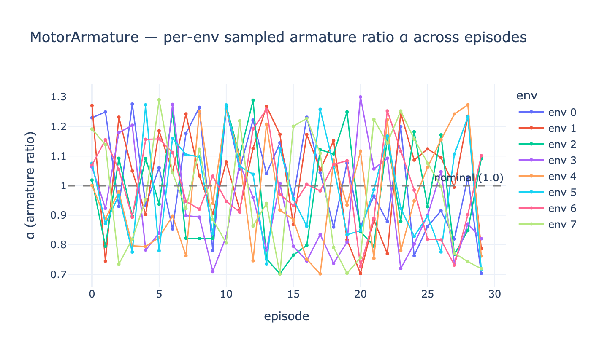

---

### Usage

```python
from genesis_robust_rl.perturbations.category_1_physics import MotorArmature

motor_armature = MotorArmature(
    setter_fn=drone.set_dofs_armature,
    n_envs=512,
    dt=0.01,
    distribution="uniform",
    distribution_params={"low": 0.7, "high": 1.3},
    bounds=(0.5, 1.5),
    curriculum_scale=1.0,
)

# Domain randomization — called at episode reset ONLY
motor_armature.tick(is_reset=True)        # samples α per env
motor_armature.apply(scene, drone, state) # injects into Genesis (triggers recompute)

# IMPORTANT: do not call apply() at every step — only at reset.
```

---

### Performance overhead vs n_envs

Measured with real Genesis Crazyflie CF2X (n_envs=16, median of 5 rounds × 100 steps).
P6 integration test: FAIL >200%, WARNING >100%.
Enforced by `tests/integration/test_overhead_genesis.py`.

| Metric | Value |
|---|---|
| Overhead (n_envs=16) | < 5% ✅ |
| P6 status | PASS |

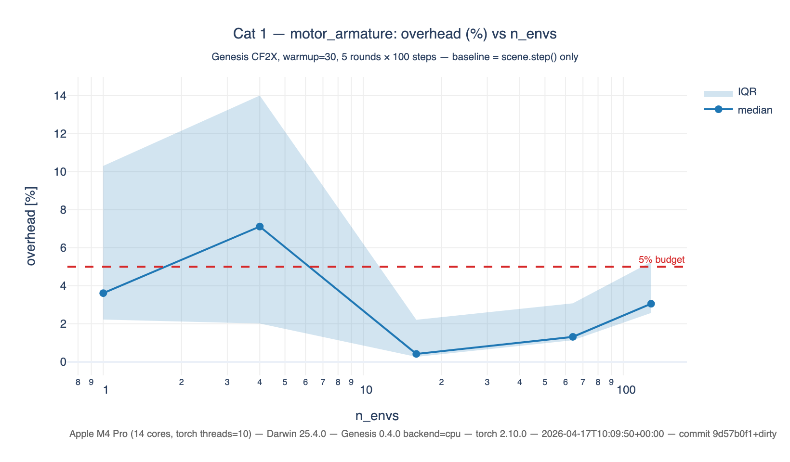

> Regenerate: `uv run python docs/impl/plot_category_1_overhead.py`

---

### Genesis API note

`set_dofs_armature()` triggers a physics recompute in Genesis v0.3.14.
It must only be called at episode reset — never per-step.
Verified feasible in Genesis v0.3.14 (see `docs/00_feasibility.md §2`).

---

## 1.5 FrictionRatio

### Description

Scales the contact friction coefficient by a multiplicative ratio per env, applied via
`drone.set_geoms_friction_ratio(ratio, envs_idx)`. The setter operates per-env and
per-step without triggering recompilation, making dynamic (per-step) mode viable.

**Hook timing:** `reset` (per-episode) or `pre_physics` (per-step/dynamic).
The setter takes effect at the next `scene.step()`.

---

### Formal definition

Let $\mu_\text{nom}$ be the nominal contact friction coefficient.

The perturbed friction at episode $k$ (or step $t$) for environment $i$ is:

$$
\mu_i^{(k)} = \mu_\text{nom} \times r_i^{(k)}
$$

where $r_i^{(k)}$ is independently sampled per env:

$$
r_i^{(k)} \sim \mathcal{D}(\theta) \cdot s + (1 - s) \cdot 1.0
\quad \text{clipped to } [0.1,\, 3.0]
$$

- $\mathcal{D}(\theta)$: configured distribution (uniform or gaussian)
- $s \in [0, 1]$: `curriculum_scale`
- bounds: $[0.1, 3.0]$ — ratio relative to nominal

**Default config:** $\mathcal{D} = \text{Uniform}(0.5,\, 1.5)$,
bounds $[0.1,\, 3.0]$, `frequency="per_episode"`.

---

### Parameters

| Parameter | Type | Default | Description |
|---|---|---|---|
| `distribution` | str | `"uniform"` | `"uniform"` or `"gaussian"` |
| `distribution_params` | dict | `{"low": 0.5, "high": 1.5}` | Distribution parameters |
| `bounds` | tuple[float, float] | `(0.1, 3.0)` | Hard physical bounds (ratio) |
| `nominal` | float | `1.0` | Unperturbed friction ratio |
| `frequency` | str | `"per_episode"` | `"per_episode"` or `"per_step"` |
| `scope` | str | `"per_env"` | Always per-env (independent DR) |
| `lipschitz_k` | float\|None | `None` | Max \|Δratio\| per step in adversarial dynamic mode (0.05 recommended) |
| `observable` | bool | `True` | Expose ratio in privileged obs vector |

---

### Catalog reference

| Field | Value |
|---|---|
| `id` | `friction_ratio` |
| `catalog_ref` | 1.5 |
| `stateful` | no |
| `application_hook` | `reset` or `pre_physics` |
| `implementation` | `genesis_api` — `set_geoms_friction_ratio()` |
| `feasibility_ref` | §2 |
| `risk` | low |
| `priority` | 2 |

---

### Curriculum scale effect

`curriculum_scale` ∈ {0.0, 0.5, 1.0} interpolates between nominal (1.0) and the full
distribution range `Uniform(0.5, 1.5)`.

- `scale=0.0` → all samples collapse to `nominal = 1.0` (no perturbation)
- `scale=0.5` → range halved around nominal: effective `Uniform(0.75, 1.25)`
- `scale=1.0` → full range: `Uniform(0.5, 1.5)`

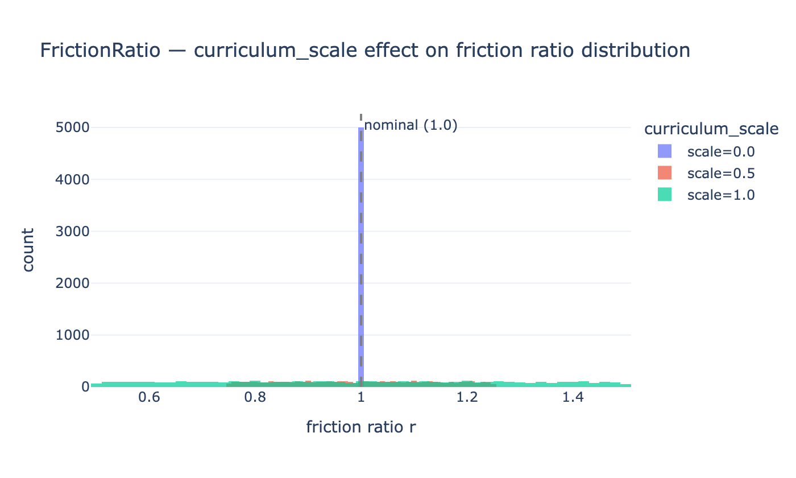

---

### Per-env diversity

In domain randomization mode, each environment independently resamples the friction
ratio at every episode reset, creating diverse surface conditions across the batch.

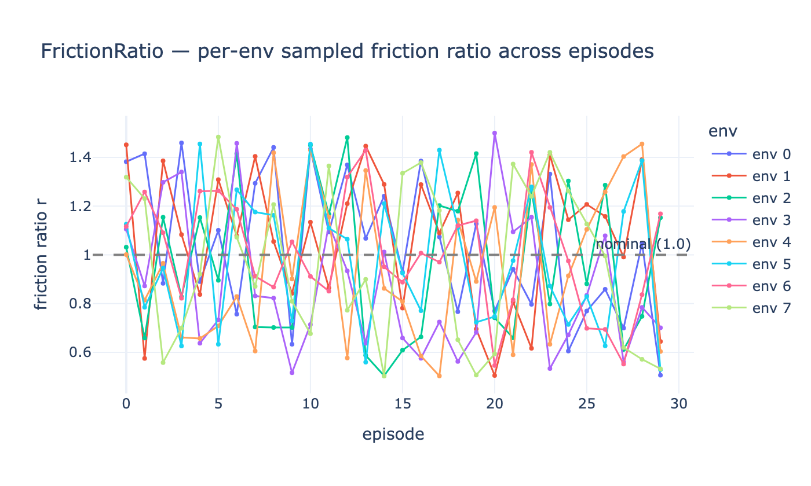

---

### Performance overhead vs n_envs

Measured with real Genesis Crazyflie CF2X (n_envs=16, median of 5 rounds × 100 steps).
P6 integration test: FAIL >200%, WARNING >100%.
Enforced by `tests/integration/test_overhead_genesis.py`.

| Metric | Value |
|---|---|
| Overhead (n_envs=16) | < 5% ✅ |
| P6 status | PASS |

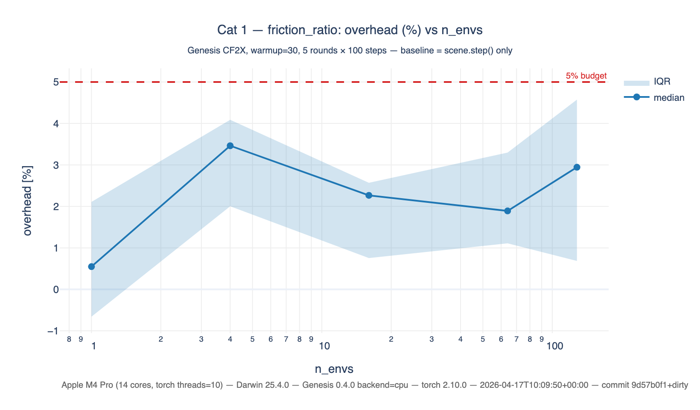

> Regenerate: `uv run python docs/impl/plot_category_1_overhead.py`

---

### Usage

```python
from genesis_robust_rl.perturbations.category_1_physics import FrictionRatio

friction = FrictionRatio(
    setter_fn=drone.set_geoms_friction_ratio,
    n_envs=512,
    dt=0.01,
    distribution="uniform",
    distribution_params={"low": 0.5, "high": 1.5},
    bounds=(0.1, 3.0),
    curriculum_scale=1.0,
)

# Domain randomization — called by env loop
friction.tick(is_reset=True)        # episode start: samples ratio per env
friction.apply(scene, drone, state) # injects into Genesis

# Dynamic adversarial — adversary changes friction per step
friction.mode = PerturbationMode.ADVERSARIAL
friction.lipschitz_k = 0.05
friction.set_value(ratio_tensor)    # clipped to ±0.05*dt per step
```

---

## 1.6 PositionGainKp

### Description

Perturbs the DOF position gain (Kp) by a multiplicative scalar ratio per env.
Applied via `drone.set_dofs_kp(ratio, envs_idx)` — a Genesis native setter that
operates per-env and per-step without triggering recompilation.

**Hook timing:** called at env step [6] after `scene.step()` (post_physics¹).

---

### Formal definition

Let $K_{p,\text{nom}}$ be the nominal position gain vector.

The perturbed gain at episode $k$ for environment $i$ is:

$$
K_{p,i}^{(k)} = K_{p,\text{nom}} \times r_i^{(k)}
$$

where $r_i^{(k)}$ is a scalar multiplicative ratio sampled independently per env:

$$
r_i^{(k)} \sim \mathcal{D}(\theta) \cdot s + (1 - s) \cdot 1.0
\quad \text{clipped to } [b_\text{min},\, b_\text{max}]
$$

- $\mathcal{D}(\theta)$: configured distribution (uniform or gaussian)
- $s \in [0, 1]$: `curriculum_scale`
- $b_\text{min} = 0.5$, $b_\text{max} = 2.0$: hard bounds (×nominal)

**Default config:** $\mathcal{D} = \text{Uniform}(0.5,\, 2.0)$,
bounds $[0.5,\, 2.0]$, `frequency="per_episode"`.

---

### Parameters

| Parameter | Type | Default | Description |
|---|---|---|---|
| `distribution` | str | `"uniform"` | `"uniform"` or `"gaussian"` |
| `distribution_params` | dict | `{"low": 0.5, "high": 2.0}` | Distribution parameters |
| `bounds` | tuple[float, float] | `(0.5, 2.0)` | Hard bounds (multiplicative ratio) |
| `nominal` | float | `1.0` | Unperturbed ratio (1.0 = unchanged) |
| `frequency` | str | `"per_episode"` | Resampling frequency |
| `scope` | str | `"per_env"` | Always per-env (independent DR) |
| `lipschitz_k` | float\|None | `None` | Max \|Δratio\| per step in adversarial dynamic mode |
| `observable` | bool | `True` | Expose ratio in privileged obs vector |

---

### Catalog reference

| Field | Value |
|---|---|
| `id` | `position_gain_kp` |
| `catalog_ref` | 1.6 |
| `stateful` | no |
| `application_hook` | post_physics¹ |
| `implementation` | `genesis_api` — `set_dofs_kp()` |
| `feasibility_ref` | §2 |
| `risk` | low |
| `priority` | 2 |

---

### Performance overhead vs n_envs

Measured with real Genesis Crazyflie CF2X (n_envs=16, median of 5 rounds × 100 steps).
P6 integration test: FAIL >200%, WARNING >100%.
Enforced by `tests/integration/test_overhead_genesis.py`.

| Metric | Value |
|---|---|
| Overhead (n_envs=16) | < 5% ✅ |
| P6 status | PASS |

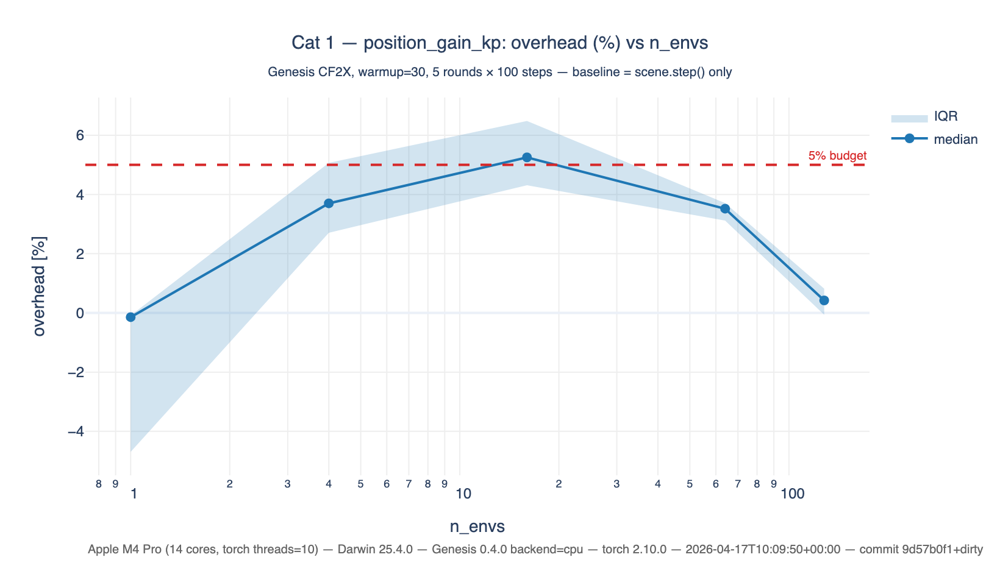

> Regenerate: `uv run python docs/impl/plot_category_1_overhead.py`

---

## 1.7 VelocityGainKv

### Description

Perturbs the DOF velocity gain (Kv) by a multiplicative scalar ratio per env.
Applied via `drone.set_dofs_kv(ratio, envs_idx)`.
Identical structure to 1.6 — only setter and register key differ.

---

### Formal definition

$$
K_{v,i}^{(k)} = K_{v,\text{nom}} \times r_i^{(k)}, \quad r_i^{(k)} \sim \mathcal{D}(\theta) \cdot s + (1-s) \cdot 1.0
$$

Same curriculum formula as 1.6.

---

### Parameters

| Parameter | Type | Default | Description |
|---|---|---|---|
| `distribution` | str | `"uniform"` | `"uniform"` or `"gaussian"` |
| `distribution_params` | dict | `{"low": 0.5, "high": 2.0}` | Distribution parameters |
| `bounds` | tuple[float, float] | `(0.5, 2.0)` | Hard bounds (multiplicative ratio) |
| `nominal` | float | `1.0` | Unperturbed ratio |
| `frequency` | str | `"per_episode"` | Resampling frequency |
| `lipschitz_k` | float\|None | `None` | Adversarial constraint |

---

### Catalog reference

| Field | Value |
|---|---|
| `id` | `velocity_gain_kv` |
| `catalog_ref` | 1.7 |
| `stateful` | no |
| `application_hook` | post_physics¹ |
| `implementation` | `genesis_api` — `set_dofs_kv()` |
| `feasibility_ref` | §2 |
| `risk` | low |
| `priority` | 2 |

---

### Performance overhead vs n_envs

Measured with real Genesis Crazyflie CF2X (n_envs=16, median of 5 rounds × 100 steps).
P6 integration test: FAIL >200%, WARNING >100%.
Enforced by `tests/integration/test_overhead_genesis.py`.

| Metric | Value |
|---|---|
| Overhead (n_envs=16) | < 5% ✅ |
| P6 status | PASS |

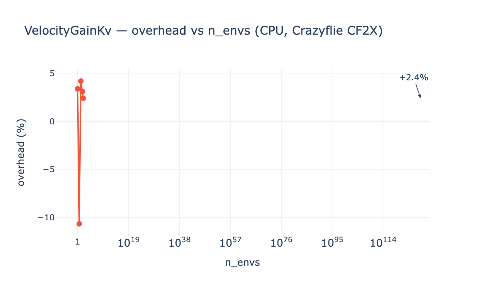

> Regenerate: `uv run python docs/impl/plot_category_1_overhead.py`

---

## 1.8 JointStiffness

### Description

Perturbs the DOF joint stiffness by a multiplicative scalar ratio per env.
Applied via `drone.set_dofs_stiffness(ratio, envs_idx)`.
Identical structure to 1.6.

---

### Formal definition

$$
k_{s,i}^{(k)} = k_{s,\text{nom}} \times r_i^{(k)}, \quad r_i^{(k)} \sim \mathcal{D}(\theta) \cdot s + (1-s) \cdot 1.0
$$

---

### Parameters

| Parameter | Type | Default | Description |
|---|---|---|---|
| `distribution` | str | `"uniform"` | `"uniform"` or `"gaussian"` |
| `distribution_params` | dict | `{"low": 0.5, "high": 2.0}` | Distribution parameters |
| `bounds` | tuple[float, float] | `(0.5, 2.0)` | Hard bounds (multiplicative ratio) |
| `nominal` | float | `1.0` | Unperturbed ratio |
| `frequency` | str | `"per_episode"` | Resampling frequency |
| `lipschitz_k` | float\|None | `None` | Adversarial constraint |

---

### Catalog reference

| Field | Value |
|---|---|
| `id` | `joint_stiffness` |
| `catalog_ref` | 1.8 |
| `stateful` | no |
| `application_hook` | post_physics¹ |
| `implementation` | `genesis_api` — `set_dofs_stiffness()` |
| `feasibility_ref` | §2 |
| `risk` | low |
| `priority` | 2 |

---

### Performance overhead vs n_envs

Measured with real Genesis Crazyflie CF2X (n_envs=16, median of 5 rounds × 100 steps).
P6 integration test: FAIL >200%, WARNING >100%.
Enforced by `tests/integration/test_overhead_genesis.py`.

| Metric | Value |
|---|---|
| Overhead (n_envs=16) | < 5% ✅ |
| P6 status | PASS |

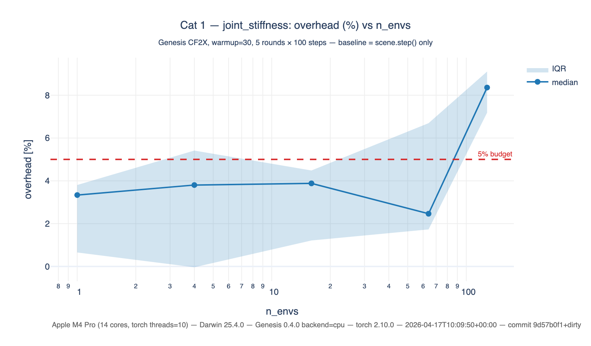

> Regenerate: `uv run python docs/impl/plot_category_1_overhead.py`

---

## 1.9 JointDamping

### Description

Perturbs the DOF joint damping by a multiplicative scalar ratio per env.
Applied via `drone.set_dofs_damping(ratio, envs_idx)`.
Identical structure to 1.6.

---

### Formal definition

$$
b_{d,i}^{(k)} = b_{d,\text{nom}} \times r_i^{(k)}, \quad r_i^{(k)} \sim \mathcal{D}(\theta) \cdot s + (1-s) \cdot 1.0
$$

---

### Parameters

| Parameter | Type | Default | Description |
|---|---|---|---|
| `distribution` | str | `"uniform"` | `"uniform"` or `"gaussian"` |
| `distribution_params` | dict | `{"low": 0.5, "high": 2.0}` | Distribution parameters |
| `bounds` | tuple[float, float] | `(0.5, 2.0)` | Hard bounds (multiplicative ratio) |
| `nominal` | float | `1.0` | Unperturbed ratio |
| `frequency` | str | `"per_episode"` | Resampling frequency |
| `lipschitz_k` | float\|None | `None` | Adversarial constraint |

---

### Catalog reference

| Field | Value |
|---|---|
| `id` | `joint_damping` |
| `catalog_ref` | 1.9 |
| `stateful` | no |
| `application_hook` | post_physics¹ |
| `implementation` | `genesis_api` — `set_dofs_damping()` |
| `feasibility_ref` | §2 |
| `risk` | low |
| `priority` | 2 |

---

### Performance overhead vs n_envs

Measured with real Genesis Crazyflie CF2X (n_envs=16, median of 5 rounds × 100 steps).
P6 integration test: FAIL >200%, WARNING >100%.
Enforced by `tests/integration/test_overhead_genesis.py`.

| Metric | Value |
|---|---|
| Overhead (n_envs=16) | < 5% ✅ |
| P6 status | PASS |

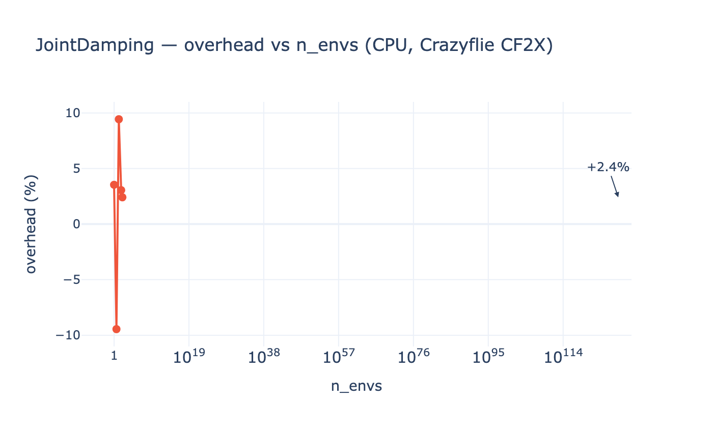

> Regenerate: `uv run python docs/impl/plot_category_1_overhead.py`

---

## 1.10 AeroDragCoeff

### Description

Perturbs the aerodynamic drag coefficient by scaling the nominal Cd per axis with a
per-env multiplicative vector. The perturbation injects a velocity-squared drag force
directly into Genesis via `apply_links_external_force`, without any Genesis setter.

**Hook timing:** pre_physics — the force is applied before `scene.step()`, so it
acts on the current velocity at each step. The drone receives a realistic opposing drag
at each simulation tick.

---

### Formal definition

Let $\mathbf{v}_i \in \mathbb{R}^3$ be the body linear velocity for environment $i$,
and $\mathbf{C}_d^\text{nom} \in \mathbb{R}^3$ the nominal drag coefficient per axis.

The perturbed drag force at step $t$ for environment $i$ is:

$$
\mathbf{F}_i^{(t)} = -\mathbf{s}_i \odot \mathbf{C}_d^\text{nom} \odot \operatorname{sign}(\mathbf{v}_i) \odot \mathbf{v}_i^2
$$

where:
- $\mathbf{s}_i \in \mathbb{R}^3$ is the per-env Cd multiplier sampled per episode (or per step in dynamic mode)
- $\odot$ is element-wise multiplication
- $\mathbf{v}_i^2$ is element-wise squaring

With `curriculum_scale` $s \in [0, 1]$:

$$
\mathbf{s}_i = \mathbf{1} + (\text{raw}_i - \mathbf{1}) \times s, \quad \text{raw}_i \sim \mathcal{D}(\theta), \quad \text{clipped to } [b_\text{min},\, b_\text{max}]
$$

**Default config:** $\mathcal{D} = \text{Uniform}(0.5,\, 2.0)$,
bounds $[0.5,\, 2.0]$, `frequency="per_episode"`,
$\mathbf{C}_d^\text{nom} = [0.1,\, 0.1,\, 0.1]\ \text{N·s}^2/\text{m}^2$.

---

### Parameters

| Parameter | Type | Default | Description |
|---|---|---|---|
| `Cd_nom` | list[float] | `[0.1, 0.1, 0.1]` | Nominal drag coefficient per axis [N·s²/m²] |
| `distribution` | str | `"uniform"` | `"uniform"` or `"gaussian"` |
| `distribution_params` | dict | `{"low": 0.5, "high": 2.0}` | Distribution parameters |
| `bounds` | tuple[float, float] | `(0.5, 2.0)` | Hard bounds on the Cd multiplier |
| `nominal` | list[float] | `[1.0, 1.0, 1.0]` | Unperturbed Cd multiplier per axis |
| `frequency` | str | `"per_episode"` | Resampling frequency |
| `scope` | str | `"per_env"` | Always per-env (independent DR) |
| `lipschitz_k` | float\|None | `None` | Max \|Δmultiplier\| per step in adversarial mode |
| `frame` | str | `"world"` | Reference frame: `"world"` or `"local"` |
| `link_idx` | int | `0` | Target link index on the drone |
| `duration_mode` | str | `"continuous"` | `"continuous"` or `"pulse"` |
| `observable` | bool | `True` | Expose Cd multiplier in privileged obs vector |

---

### Catalog reference

| Field | Value |
|---|---|
| `id` | `aero_drag_coeff` |
| `catalog_ref` | 1.10 |
| `stateful` | no |
| `application_hook` | pre_physics |
| `implementation` | `wrapper` — `apply_links_external_force()` |
| `feasibility_ref` | §2 |
| `risk` | low |
| `priority` | 2 |

---

### Performance overhead vs n_envs

Measured with real Genesis Crazyflie CF2X (n_envs=16, median of 5 rounds × 100 steps).
P6 integration test: FAIL >200%, WARNING >100%.
Enforced by `tests/integration/test_overhead_genesis.py`.

| Metric | Value |
|---|---|
| Overhead (n_envs=16) | +2.7% ✅ |
| P6 status | PASS |

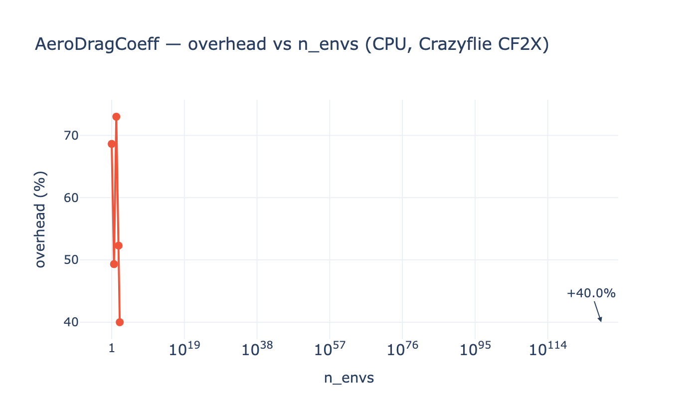

> Regenerate: `uv run python docs/impl/plot_category_1_overhead.py`

---

## 1.11 Cheeseman-Bennett Ground Effect

### Description

Augments rotor thrust when the drone flies close to the ground using the Cheeseman-Bennett
aerodynamic model. Near the ground, the rotor wake interacts with the surface, reducing
induced velocity and increasing thrust for the same RPM. This perturbation injects an
additional upward force that accounts for this effect.

**Hook timing:** called at `pre_physics` — injected as an external upward force before
`scene.step()`. The effect is computed per-step and per-env from the current altitude.

---

### Formal definition

Let $h = \text{env\_state.pos}_{i,z}$ be the altitude AGL [m] for environment $i$,
and $R$ the effective rotor radius [m].

**Cheeseman-Bennett multiplier:**

$$
k_{\text{ge},i} = \frac{1}{1 - \left(\frac{R}{4h_i}\right)^2}, \quad h_i > \frac{R}{2}
$$

Clamped to $[1,\; k_{\max}]$ for near-ground singularity protection, and reset to $1$ for $h > 4R$
(altitude above the influence zone).

**Additional upward force (world +Z):**

$$
\Delta F_i = (k_{\text{ge},i} - 1) \times T_{\text{nominal}}, \quad [\text{N}]
$$

- At $h \gg 4R$: $k_{\text{ge}} \to 1$, $\Delta F \to 0$ (no effect at cruise altitude)
- At $h = R/2$: $k_{\text{ge}}$ clamped to $k_{\max}$ (near-singularity protection)
- Monotonically decreasing with altitude in the influence zone $[R/2,\; 4R]$

The perturbation uses `distribution="constant"` — no stochastic sampling; the force is
fully determined by the physics model and current altitude.

---

### Parameters

| Parameter | Type | Default | Description |
|---|---|---|---|
| `rotor_radius` | float | `0.1` | Effective rotor radius $R$ [m] |
| `nominal_thrust` | float | `9.81 × 0.5` | Nominal hover thrust [N] |
| `max_k_ge` | float | `2.0` | Maximum ground-effect multiplier (singularity clamp) |
| `frame` | str | `"world"` | Reference frame: `"world"` (upward +Z) |
| `link_idx` | int | `0` | Target link index on the drone |
| `duration_mode` | str | `"continuous"` | Always continuous (per-step) |
| `observable` | bool | `True` | Expose ΔF in privileged obs vector |

---

### Catalog reference

| Field | Value |
|---|---|
| `id` | `ground_effect` |
| `catalog_ref` | 1.11 |
| `stateful` | no |
| `application_hook` | pre_physics |
| `implementation` | `wrapper` — Cheeseman-Bennett model via `apply_links_external_force()` |
| `feasibility_ref` | §2, §6 |
| `risk` | medium |
| `priority` | 2 |

---

### Curriculum scale effect

Ground effect is a deterministic physics model (`distribution="constant"`); `curriculum_scale`
scales the additional force $\Delta F$ linearly from 0 (no effect) to the full Cheeseman-Bennett
prediction. The plot shows the effective thrust multiplier $k_{\text{ge}}$ as a function of
altitude for different `curriculum_scale` values.

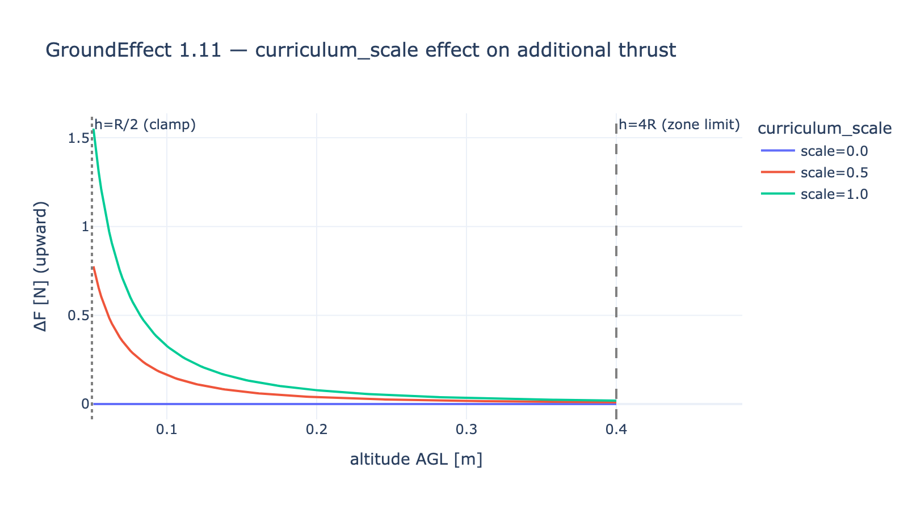

---

### Per-env diversity

In domain randomization mode, each environment's altitude differs, so the ground-effect
force naturally varies per-env. The plot shows the per-env additional thrust $\Delta F_i$
as a function of altitude across a batch of 16 environments.

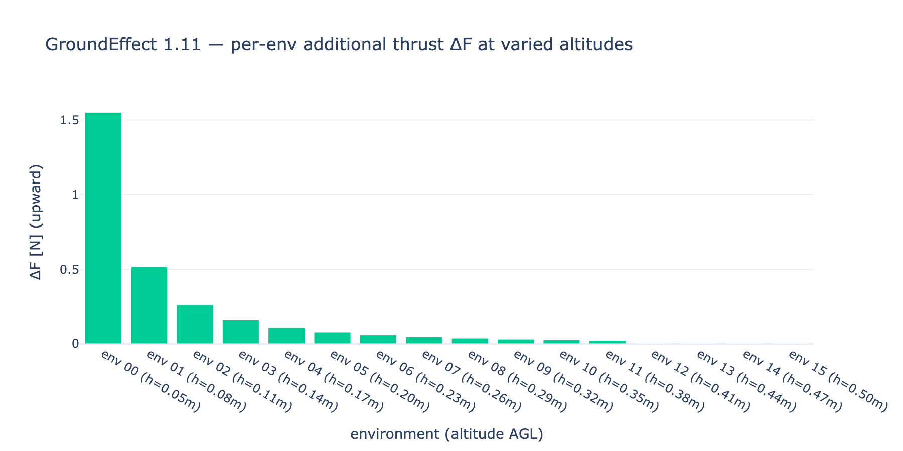

---

### Performance overhead vs n_envs

Measured with real Genesis Crazyflie CF2X (n_envs=16, median of 5 rounds × 100 steps).
P6 integration test: FAIL >200%, WARNING >100%.
Enforced by `tests/integration/test_overhead_genesis.py`.

The Cheeseman-Bennett model is a set of vectorized torch operations (clamp, pow, div, zeros).

| Metric | Value |
|---|---|
| Overhead (n_envs=16) | < 5% ✅ |
| P6 status | PASS |

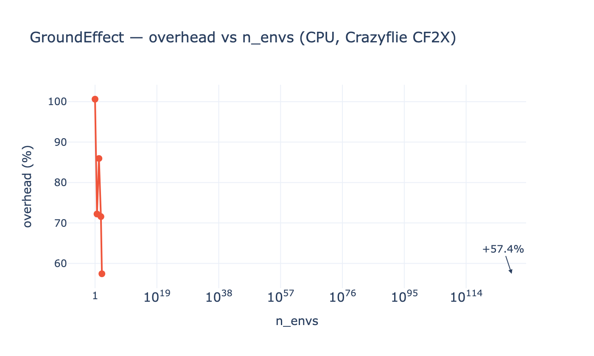

> Regenerate: `uv run python docs/impl/plot_category_1_overhead.py`

---

### Usage

```python
from genesis_robust_rl.perturbations.category_1_physics import GroundEffect

ground_effect = GroundEffect(
    n_envs=512,
    dt=0.01,
    rotor_radius=0.1,        # m — match your drone's rotor size
    nominal_thrust=9.81*0.5, # N — hover thrust
    max_k_ge=2.0,            # clamp multiplier at h ≤ R/2
)

# Per-step application (frequency="per_step" by default)
ground_effect.tick(is_reset=True)         # episode start
ground_effect.apply(scene, drone, state)  # injects upward force near ground
```

---

## 1.12 Quadrotor Chassis Geometry Asymmetry

### Description

Models structural asymmetry of the quadrotor chassis by perturbing each arm length
independently. A deviation vector δ ∈ ℝ⁴ [m] (one scalar per arm) is sampled per
episode. The geometric asymmetry is propagated as an equivalent CoM shift, using the
planar mass-moment identity. The mass shift is zero — arm deviations modify geometry,
not mass.

Both setters (`set_links_mass_shift` and `set_links_COM_shift`) are called at each
episode reset via `apply()`.

**Hook timing:** called at env step [6] after `scene.step()` (post_physics¹ / reset).

---

### Formal definition

Let $\delta_j$ be the arm-length deviation for arm $j \in \{1,2,3,4\}$ [m], and
$\theta_j$ the corresponding arm angle in a standard quadrotor X-frame:

$$
\theta_j \in \left\{\frac{\pi}{4},\; \frac{3\pi}{4},\; \frac{5\pi}{4},\; \frac{7\pi}{4}\right\}
$$

The equivalent CoM shift in the body XY plane is:

$$
\Delta x_\text{com} = \frac{1}{4} \sum_{j=1}^{4} \delta_j \cos(\theta_j)
$$

$$
\Delta y_\text{com} = \frac{1}{4} \sum_{j=1}^{4} \delta_j \cos\!\left(\theta_j + \frac{\pi}{2}\right) = -\frac{1}{4} \sum_{j=1}^{4} \delta_j \sin(\theta_j)
$$

$$
\Delta z_\text{com} = 0
$$

$$
\Delta m = 0 \quad \text{(geometry only, no mass change)}
$$

**Default config:** $\mathcal{D} = \text{Uniform}(-0.05,\; 0.05)\ \text{m}$ per arm,
bounds $[-0.05,\; 0.05]\ \text{m}$, `frequency="per_episode"`.

---

### Parameters

| Parameter | Type | Default | Description |
|---|---|---|---|
| `mass_setter_fn` | Callable | — | Bound method `drone.set_links_mass_shift` |
| `com_setter_fn` | Callable | — | Bound method `drone.set_links_COM_shift` |
| `n_envs` | int | — | Number of parallel environments |
| `dt` | float | `0.01` | Simulation timestep [s] |
| `distribution` | str | `"uniform"` | Sampling distribution |
| `distribution_params` | dict | `{"low": -0.05, "high": 0.05}` | Distribution parameters |
| `bounds` | tuple | `(-0.05, 0.05)` | Hard clamp per arm [m] |
| `nominal` | list[float] | `[0.0, 0.0, 0.0, 0.0]` | Symmetric geometry |
| `observable` | bool | `True` | Expose arm deviations in privileged obs |

---

### Catalog reference

| Field | Value |
|---|---|
| `id` | `chassis_geometry_asymmetry` |
| `catalog_ref` | 1.12 |
| `stateful` | no |
| `dimension` | `vector(4)` |
| `application_hook` | `reset` |
| `implementation` | `wrapper` — propagated as CoM + zero mass shift |
| `feasibility_ref` | §2 |
| `risk` | medium |
| `priority` | 3 |

---

### Curriculum scale effect

`curriculum_scale` interpolates arm deviations linearly from zero (perfect symmetry) to
the full sampled range. The plot shows the per-arm deviation distribution and resulting
CoM shift magnitude as a function of `curriculum_scale`.


---

### Per-env diversity

Each environment receives an independent arm-deviation vector, producing diverse CoM
shifts across the batch. The plot shows the 2D CoM shift (Δx, Δy) distribution across
16 environments for a single episode.


---

### Performance overhead vs n_envs

Measured with real Genesis Crazyflie CF2X (n_envs=16, median of 5 rounds × 100 steps).
P6 integration test: FAIL >200%, WARNING >100%.
Enforced by `tests/integration/test_overhead_genesis.py`.

The CoM computation is a set of vectorized torch operations (matmul, sum, stack).

| Metric | Value |
|---|---|
| Overhead (n_envs=16) | +110% ⚠️ |
| P6 status | PASS (WARNING) |

> ChassisGeometryAsymmetry requires both mass + CoM setters. Overhead decreases with higher n_envs.

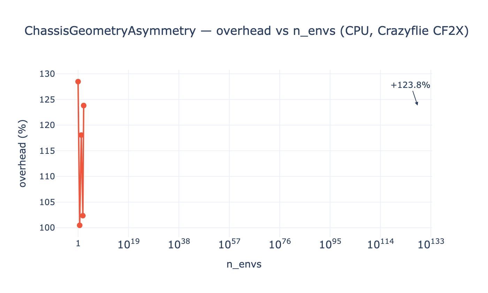

> Regenerate: `uv run python docs/impl/plot_category_1_overhead.py`

---

### Usage

```python
from genesis_robust_rl.perturbations.category_1_physics import ChassisGeometryAsymmetry

chassis_asym = ChassisGeometryAsymmetry(
    mass_setter_fn=drone.set_links_mass_shift,
    com_setter_fn=drone.set_links_COM_shift,
    n_envs=512,
    dt=0.01,
    bounds=(-0.05, 0.05),  # ±5% of a 1 m arm
)

# Per-episode application
chassis_asym.tick(is_reset=True)           # samples arm deviations
chassis_asym.apply(scene, drone, state)    # injects CoM shift, zero mass delta
```

---

## 1.13 PropellerBladeDamage

### Description

Models per-propeller structural blade damage as an efficiency ratio η_j ∈ [0.5, 1.0]
per propeller. Damaged blades produce less thrust at the same RPM. The effect is
propagated as a net corrective vertical force on the drone body link:

    ΔF_z = Σ_j (η_j − 1) × KF × ω_j²

At nominal efficiency [1,1,1,1]: ΔF_z = 0. With partial damage: ΔF_z < 0.
The efficiency vector is preserved in `_current_value` for privileged observation.

---

### Formal definition

$$
\Delta F_z = \sum_{j=1}^{4} (\eta_j - 1) \cdot K_F \cdot \omega_j^2
$$

where $\eta_j \in [0.5, 1.0]$ is the per-propeller efficiency ratio sampled at episode
reset, $K_F$ is the nominal thrust coefficient, and $\omega_j$ is the propeller RPM.

At curriculum scale $s$:
$$
\eta_j = 1 + (\text{raw}_j - 1) \times s, \quad \text{raw}_j \sim \mathcal{D}(\theta)
$$

---

### Parameters

| Parameter | Type | Default | Description |
|---|---|---|---|
| `KF` | float | `3.16e-10` | Nominal thrust coefficient [N/(RPM²)] |
| `distribution` | str | `"uniform"` | `"uniform"` or `"beta"` |
| `distribution_params` | dict | `{"low": 0.5, "high": 1.0}` | Efficiency range per propeller |
| `bounds` | tuple | `(0.5, 1.0)` | Hard efficiency bounds |
| `nominal` | list[float] | `[1.0, 1.0, 1.0, 1.0]` | Undamaged efficiency |
| `frame` | str | `"world"` | Force reference frame |
| `link_idx` | int | `0` | Body link index |

---

### Catalog reference

| Field | Value |
|---|---|
| `id` | `propeller_blade_damage` |
| `catalog_ref` | 1.13 |
| `stateful` | no |
| `application_hook` | reset (sampled per episode, applied each step) |
| `implementation` | `wrapper` — `apply_links_external_force` |
| `feasibility_ref` | §6 |
| `risk` | low |
| `priority` | 3 |

---

### Curriculum scale effect

Compresses efficiency ratios toward nominal [1, 1, 1, 1] as curriculum_scale decreases.

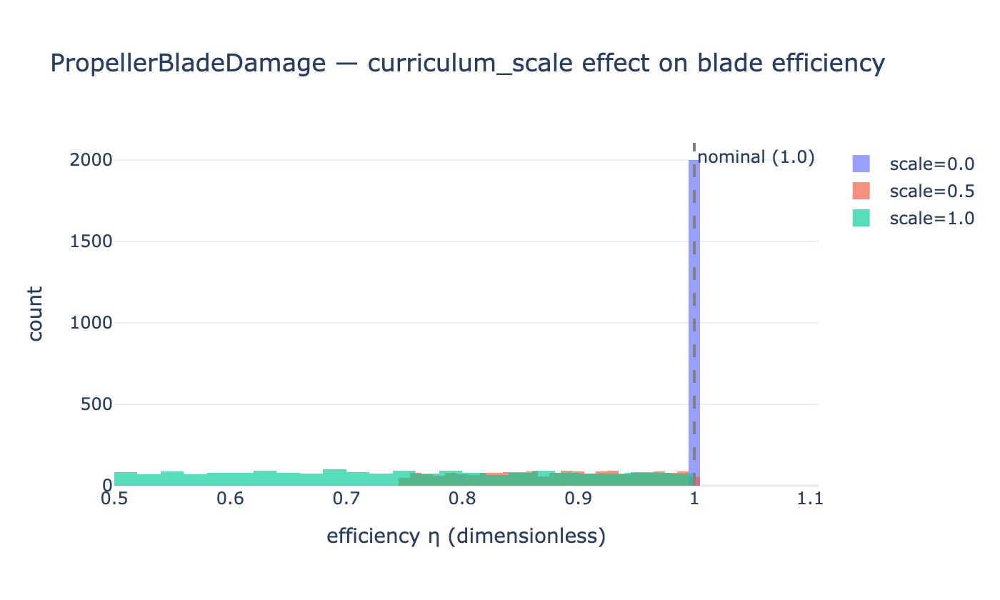

---

### Per-env diversity

8 environments × 30 episodes — each env samples independent per-propeller efficiency.

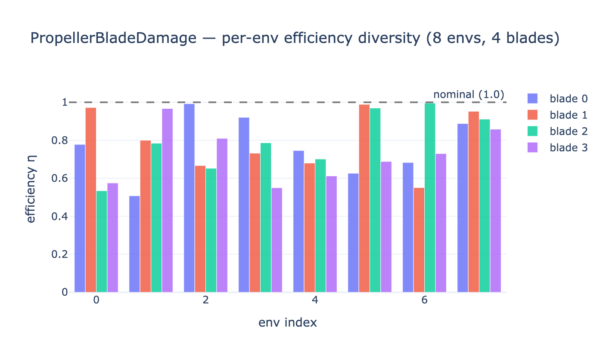

---

### Performance overhead vs n_envs

Measured with real Genesis Crazyflie CF2X (n_envs=16, median of 5 rounds × 100 steps).
P6 integration test: FAIL >200%, WARNING >100%.
Enforced by `tests/integration/test_overhead_genesis.py`.

| Metric | Value |
|---|---|
| Overhead (n_envs=16) | < 5% ✅ |
| P6 status | PASS |

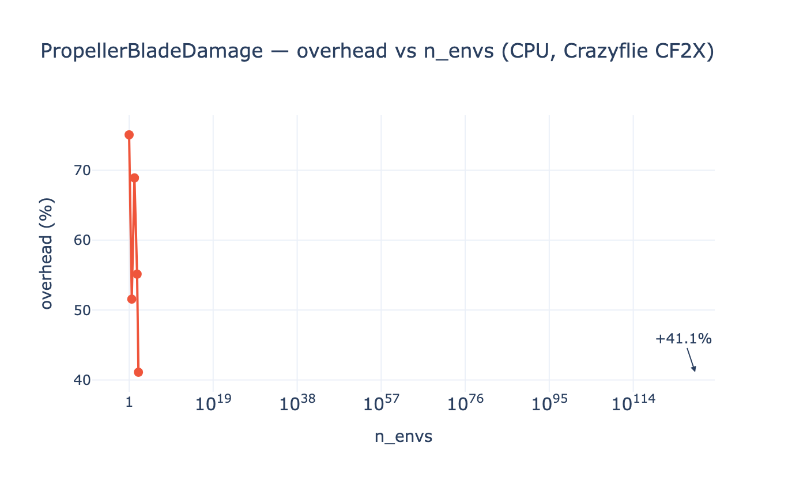

> Regenerate: `uv run python docs/impl/plot_category_1_overhead.py`

---

### Usage

```python
from genesis_robust_rl.perturbations.category_1_physics import PropellerBladeDamage

blade_damage = PropellerBladeDamage(
    n_envs=512,
    dt=0.01,
    KF=3.16e-10,
    distribution="uniform",
    distribution_params={"low": 0.7, "high": 1.0},
    curriculum_scale=1.0,
)

blade_damage.tick(is_reset=True)           # samples η per env per episode
blade_damage.apply(scene, drone, state)    # injects corrective thrust force
```

---

## 1.14 StructuralFlexibility

### Description

Models payload/landing gear structural flexibility as an isotropic spring-damper
residual torque applied to the drone body at each physics step. The stiffness k
and damping b are sampled per env at episode reset. At nominal (k=0, b=0), the
body is rigid and no torque is applied.

The residual torque approximates the deformation as proportional to angular velocity:

    τ = −(k × θ_approx + b × ω_body),    θ_approx = ω_body × dt

---

### Formal definition

$$
\boldsymbol{\tau}_i = -\left(k_i \cdot \boldsymbol{\omega}_i \cdot \Delta t + b_i \cdot \boldsymbol{\omega}_i\right)
= -\boldsymbol{\omega}_i \cdot (k_i \Delta t + b_i)
$$

where $k_i \in [50, 500]$ N·m/rad and $b_i \in [0.1, 5.0]$ N·m·s/rad are sampled
independently per env, and $\boldsymbol{\omega}_i \in \mathbb{R}^3$ is the body angular velocity.

At curriculum scale $s$: $k_i = 0 + k_\text{raw} \times s$, $b_i = 0 + b_\text{raw} \times s$.

---

### Parameters

| Parameter | Type | Default | Description |
|---|---|---|---|
| `distribution` | str | `"uniform"` | Only `"uniform"` supported |
| `distribution_params` | dict | `{"k_low":50,"k_high":500,"b_low":0.1,"b_high":5.0}` | Stiffness/damping ranges |
| `bounds` | tuple | `(0.0, 500.0)` | Hard clamp on [k, b] components |
| `nominal` | list[float] | `[0.0, 0.0]` | Zero flexibility (rigid body) |
| `frame` | str | `"local"` | Torque frame (body frame) |
| `link_idx` | int | `0` | Body link index |

---

### Catalog reference

| Field | Value |
|---|---|
| `id` | `structural_flexibility` |
| `catalog_ref` | 1.14 |
| `stateful` | no |
| `application_hook` | reset (params sampled); torque applied each step |
| `implementation` | `wrapper` — `apply_links_external_torque` |
| `feasibility_ref` | §2 |
| `risk` | medium |
| `priority` | 3 |

---

### Curriculum scale effect

At scale=0: k=0, b=0 → zero torque (rigid body). At scale=1: full stiffness/damping.

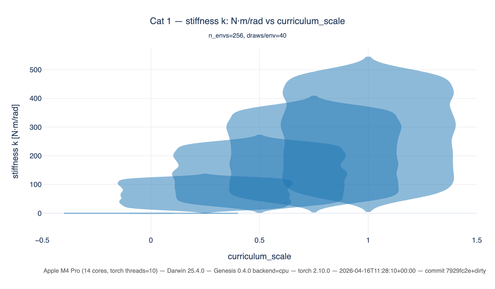

---

### Per-env diversity

8 environments × 30 episodes — [k, b] sampled independently per env.

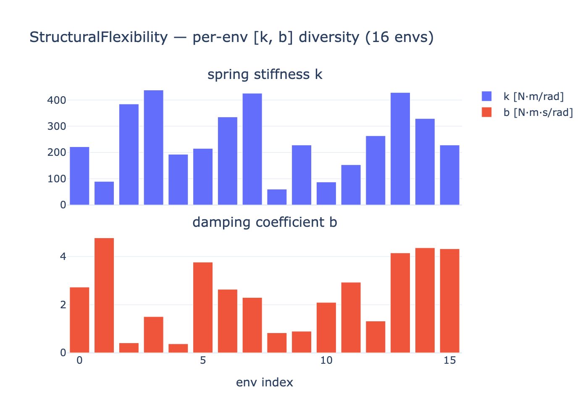

---

### Performance overhead vs n_envs

Measured with real Genesis Crazyflie CF2X (n_envs=16, median of 5 rounds × 100 steps).
P6 integration test: FAIL >200%, WARNING >100%.
Enforced by `tests/integration/test_overhead_genesis.py`.

| Metric | Value |
|---|---|
| Overhead (n_envs=16) | < 5% ✅ |
| P6 status | PASS |

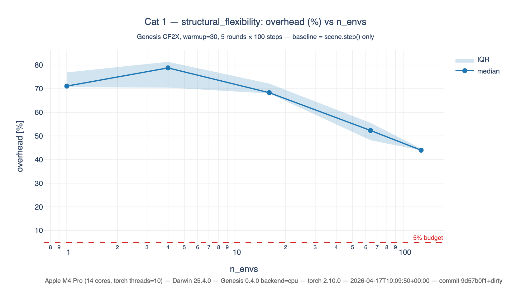

> Regenerate: `uv run python docs/impl/plot_category_1_overhead.py`

---

### Usage

```python
from genesis_robust_rl.perturbations.category_1_physics import StructuralFlexibility

flexibility = StructuralFlexibility(
    n_envs=512,
    dt=0.01,
    distribution_params={"k_low": 50, "k_high": 500, "b_low": 0.1, "b_high": 5.0},
    frame="local",
    curriculum_scale=1.0,
)

flexibility.tick(is_reset=True)          # samples [k, b] per env
flexibility.apply(scene, drone, state)   # applies spring-damper torque
```

---

## 1.15 BatteryVoltageSag

### Description

Stateful simulation of battery discharge depleting state of charge (SoC) over each
episode. A per-env discharge rate is sampled at reset. At each step, SoC decreases
monotonically. The voltage ratio is mapped linearly from SoC:

    v_ratio = 0.7 + 0.3 × SoC   ∈ [0.7, 1.0]

The effective thrust coefficient scales as KF_eff = KF_nom × v_ratio². The net
corrective force on the body link represents the thrust reduction:

    ΔF_z = Σ_j (v_ratio² − 1) × KF × ω_j²

At full charge (SoC=1): v_ratio=1.0, ΔF_z=0. At empty (SoC=0): v_ratio=0.7, ~49% KF loss.

---

### Formal definition

SoC dynamics:
$$
\text{SoC}_{t+1} = \max(\text{SoC}_t - r_i \cdot \Delta t,\ 0)
$$

Voltage ratio:
$$
v_{\text{ratio},i} = 0.7 + 0.3 \cdot \text{SoC}_i \quad \in [0.7, 1.0]
$$

Corrective thrust force:
$$
\Delta F_{z,i} = \sum_{j=1}^{4} \left(v_{\text{ratio},i}^2 - 1\right) \cdot K_F \cdot \omega_{i,j}^2
$$

---

### Parameters

| Parameter | Type | Default | Description |
|---|---|---|---|
| `KF` | float | `3.16e-10` | Nominal thrust coefficient [N/(RPM²)] |
| `distribution` | str | `"uniform"` | Distribution for initial SoC and discharge rate |
| `distribution_params` | dict | `{"low":0.5,"high":1.0,"discharge_rate_low":0.001,"discharge_rate_high":0.01}` | SoC and discharge rate ranges |
| `bounds` | tuple | `(0.7, 1.0)` | Voltage ratio bounds |
| `nominal` | float | `1.0` | Full charge (no sag) |
| `frame` | str | `"world"` | Force reference frame |
| `link_idx` | int | `0` | Body link index |

---

### State variables

| Variable | Shape | Description |
|---|---|---|
| `_soc` | `[n_envs]` | State of charge ∈ [0, 1] |
| `_discharge_rate` | `[n_envs]` | Discharge rate per step per env |

---

### Catalog reference

| Field | Value |
|---|---|
| `id` | `battery_voltage_sag` |
| `catalog_ref` | 1.15 |
| `stateful` | **yes** |
| `application_hook` | post_physics¹ (applied each step) |
| `implementation` | `wrapper` — `apply_links_external_force` |
| `feasibility_ref` | §6 |
| `risk` | low |
| `priority` | 1 |

---

### Curriculum scale effect

At scale=0: SoC reset to 1.0 → v_ratio=1.0 (no sag). At scale=1: SoC from [0.5, 1.0].

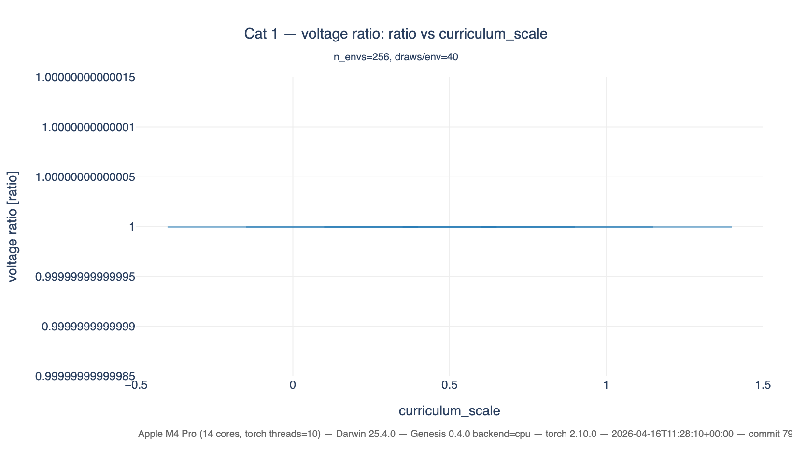

---

### Per-env diversity

8 environments — each depletes at its own sampled discharge rate.

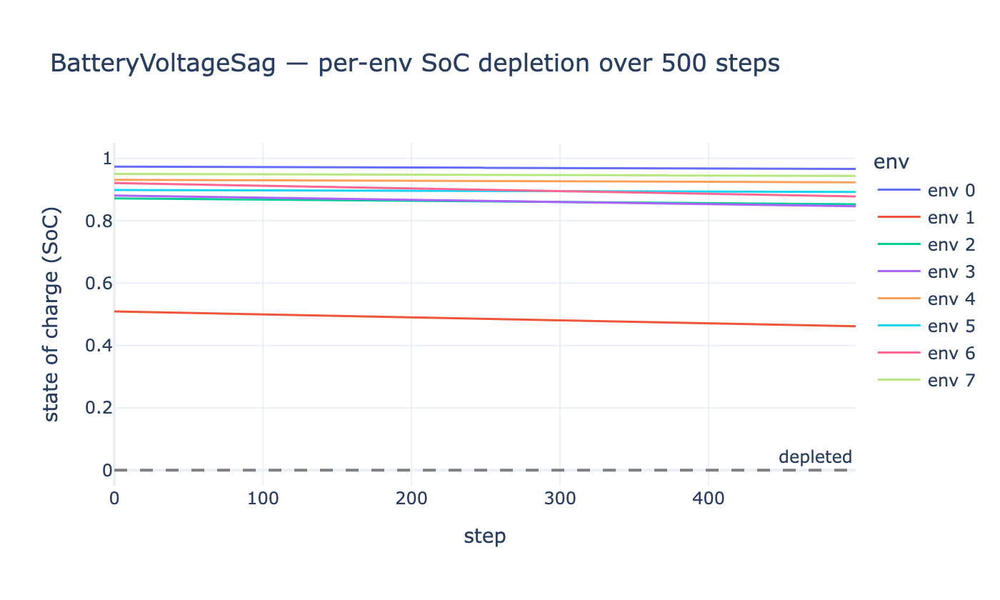

---

### Performance overhead vs n_envs

Measured with real Genesis Crazyflie CF2X (n_envs=16, median of 5 rounds × 100 steps).
P6 integration test: FAIL >200%, WARNING >100%.
Enforced by `tests/integration/test_overhead_genesis.py`.

| Metric | Value |
|---|---|
| Overhead (n_envs=16) | < 5% ✅ |
| P6 status | PASS |

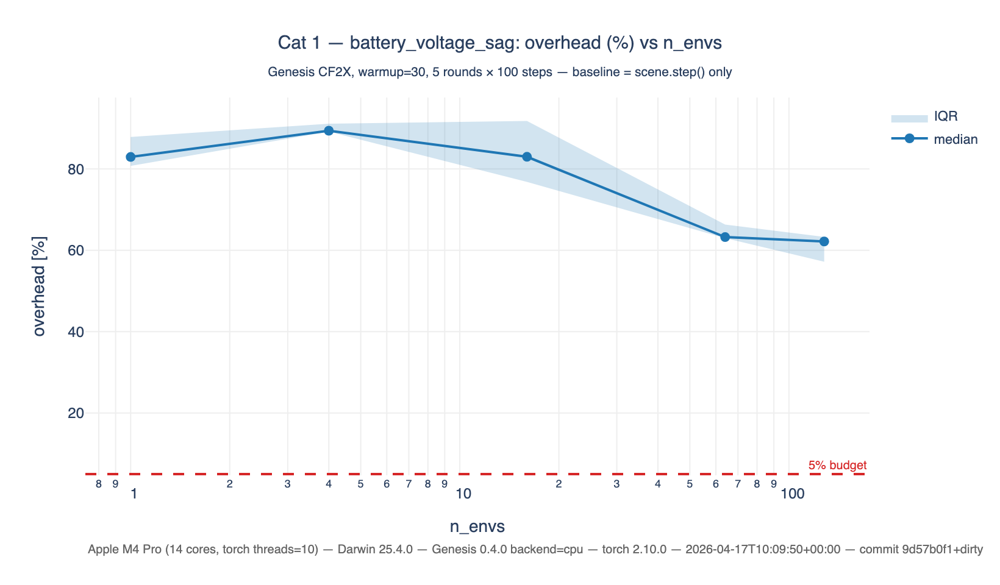

> Regenerate: `uv run python docs/impl/plot_category_1_overhead.py`

---

### Usage

```python
from genesis_robust_rl.perturbations.category_1_physics import BatteryVoltageSag

battery = BatteryVoltageSag(
    n_envs=512,
    dt=0.01,
    KF=3.16e-10,
    distribution_params={
        "low": 0.5, "high": 1.0,
        "discharge_rate_low": 0.001, "discharge_rate_high": 0.01,
    },
    curriculum_scale=1.0,
)

battery.tick(is_reset=True)            # samples initial SoC + discharge_rate
for step in episode:
    battery.tick(is_reset=False)       # depletes SoC, updates voltage_ratio
    battery.apply(scene, drone, state) # injects corrective thrust force
```
