# Motor Dynamics Perturbations

> Technical reference for implemented perturbations in category 2.
> Source: `src/genesis_robust_rl/perturbations/category_2_motor.py`
> Plots generated by: `docs/impl/plot_category_2.py`

---

## 2.1 ThrustCoefficientKF

### Description

Perturbs the thrust coefficient $K_F$ (N/RPM^2) and injects the thrust delta as an
upward external force on the drone body. Applied via
`scene.rigid_solver.apply_links_external_force()`.

**Hook timing:** called at env step [6] after `scene.step()` (post_physics^1).
The external force takes effect at the **next** `scene.step()`.

---

### Formal definition

Let $K_{F,\text{nom}}$ be the nominal thrust coefficient and $\text{RPM}_i$ the current RPM
of propeller $i$.

The thrust delta injected along the world Z axis is:

$$
\Delta F_z = \sum_{i=1}^{4} (K_{F,\text{pert}} - K_{F,\text{nom}}) \cdot \text{RPM}_i^2
$$

where $K_{F,\text{pert}}$ is sampled per env:

$$
K_{F,\text{pert}} = K_{F,\text{nom}} + (\text{raw} - K_{F,\text{nom}}) \times s, \quad \text{raw} \sim \mathcal{D}(\theta)
$$

- $s \in [0,1]$: `curriculum_scale`
- Clipped to `bounds`

**Default config:** $\mathcal{D} = \text{Uniform}(2.53 \times 10^{-10},\, 3.79 \times 10^{-10})$,
bounds $[1.58 \times 10^{-10},\, 4.74 \times 10^{-10}]$, `frequency="per_episode"`.

---

### Parameters

| Parameter | Type | Default | Description |
|---|---|---|---|
| `KF_nom` | float | `3.16e-10` | Nominal thrust coefficient (N/RPM^2) |
| `distribution` | str | `"uniform"` | `"uniform"` or `"gaussian"` |
| `distribution_params` | dict | `{"low": 2.53e-10, "high": 3.79e-10}` | Distribution parameters |
| `bounds` | tuple[float, float] | `(1.58e-10, 4.74e-10)` | Hard physical bounds |
| `nominal` | float | `3.16e-10` | Unperturbed KF value |
| `frequency` | str | `"per_episode"` | Resampling frequency |
| `scope` | str | `"per_env"` | Always per-env |
| `lipschitz_k` | float\|None | `None` | Max change per step |
| `frame` | str | `"world"` | Force reference frame |
| `link_idx` | int | `0` | Body link index |

---

### Catalog reference

| Field | Value |
|---|---|
| `id` | `thrust_coeff_kf` |
| `catalog_ref` | 2.1 |
| `stateful` | no |
| `application_hook` | pre_physics (via external force) |
| `implementation` | `wrapper` -- `apply_links_external_force` |
| `feasibility_ref` | S6 |
| `risk` | low |
| `priority` | 1 |

---

### Curriculum scale effect

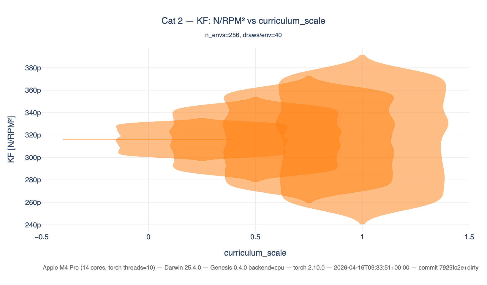

---

### Per-env diversity

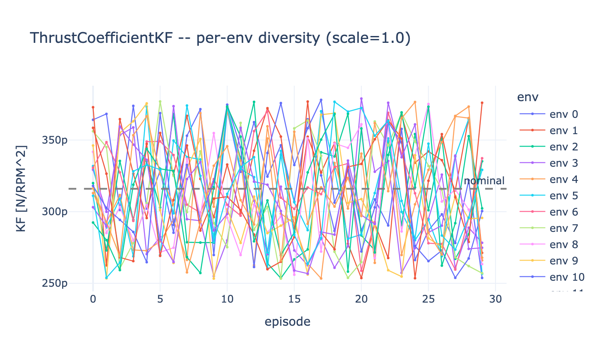

---

### Usage

```python
from genesis_robust_rl.perturbations.category_2_motor import ThrustCoefficientKF

kf = ThrustCoefficientKF(n_envs=512, dt=0.01)

# Domain randomization
kf.tick(is_reset=True)
kf.apply(scene, drone, env_state)
```

---

### Genesis API note

Uses `scene.rigid_solver.apply_links_external_force()` to inject the thrust delta.
Only the Z component of the force is nonzero (world frame, upward).

---

## 2.2 TorqueCoefficientKM

### Description

Perturbs the reactive torque coefficient $K_M$ (N.m/RPM^2) and injects the torque delta
about the Z axis via `scene.rigid_solver.apply_links_external_torque()`.
Accounts for CW/CCW propeller spin directions.

**Hook timing:** post_physics^1 (external torque takes effect at next step).

---

### Formal definition

$$
\Delta \tau_z = \sum_{i=1}^{4} s_i \cdot (K_{M,\text{pert}} - K_{M,\text{nom}}) \cdot \text{RPM}_i^2
$$

where $s_i \in \{+1, -1\}$ is the spin sign of propeller $i$ (CW/CCW).

**Default config:** $\mathcal{D} = \text{Uniform}(2.53 \times 10^{-12},\, 3.79 \times 10^{-12})$,
bounds $[1.58 \times 10^{-12},\, 4.74 \times 10^{-12}]$, nominal $= 3.16 \times 10^{-12}$.

---

### Parameters

| Parameter | Type | Default | Description |
|---|---|---|---|
| `KM_nom` | float | `3.16e-12` | Nominal torque coefficient (N.m/RPM^2) |
| `spin_signs` | list[float] | `[1, -1, 1, -1]` | CW/CCW propeller signs |
| `distribution` | str | `"uniform"` | `"uniform"` or `"gaussian"` |
| `distribution_params` | dict | `{"low": 2.53e-12, "high": 3.79e-12}` | Distribution parameters |
| `bounds` | tuple[float, float] | `(1.58e-12, 4.74e-12)` | Hard physical bounds |
| `nominal` | float | `3.16e-12` | Unperturbed KM value |
| `frequency` | str | `"per_episode"` | Resampling frequency |
| `lipschitz_k` | float\|None | `None` | Max change per step |

---

### Catalog reference

| Field | Value |
|---|---|
| `id` | `torque_coeff_km` |
| `catalog_ref` | 2.2 |
| `stateful` | no |
| `application_hook` | pre_physics (via external torque) |
| `implementation` | `wrapper` -- `apply_links_external_torque` |
| `feasibility_ref` | S6 |
| `risk` | low |
| `priority` | 1 |

---

### Curriculum scale effect

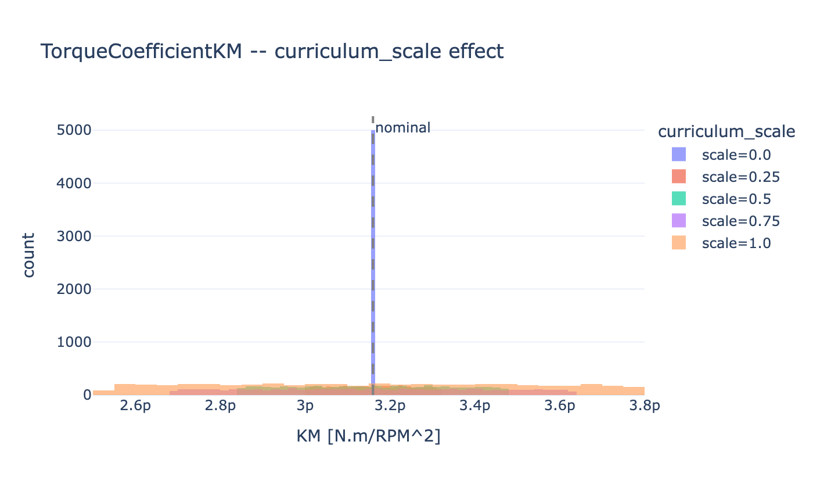

---

### Per-env diversity

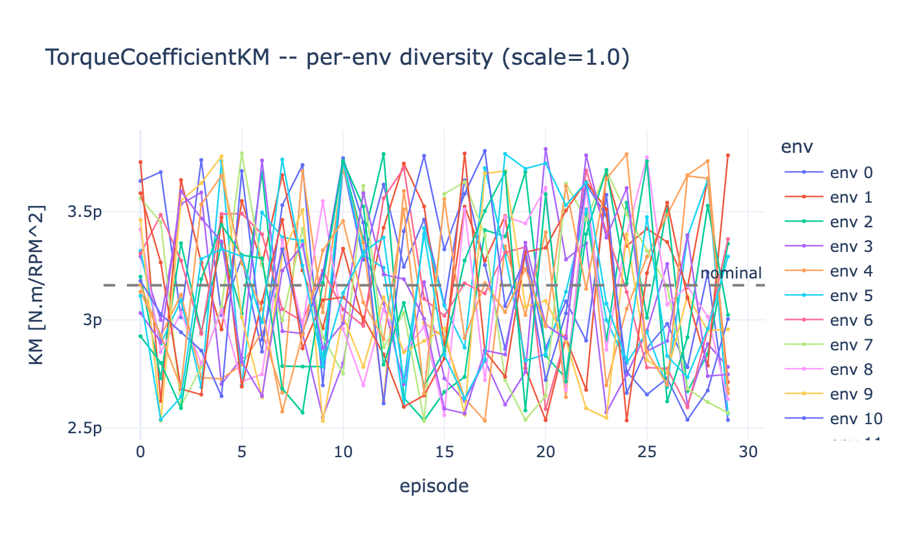

---

### Usage

```python
from genesis_robust_rl.perturbations.category_2_motor import TorqueCoefficientKM

km = TorqueCoefficientKM(n_envs=512, dt=0.01)
km.tick(is_reset=True)
km.apply(scene, drone, env_state)
```

---

### Genesis API note

Uses `scene.rigid_solver.apply_links_external_torque()`. Only the Z component is nonzero.
Spin signs `[+1, -1, +1, -1]` follow the standard CF2X X-frame configuration.

---

## 2.3 PropellerThrustAsymmetry

### Description

Applies per-propeller thrust ratio multipliers relative to the nominal $K_F$.
Each propeller gets an independent ratio $r_i$, creating asymmetric thrust distribution.
Injected as a vertical external force.

**Hook timing:** post_physics^1 (external force).

---

### Formal definition

$$
\Delta F_z = \sum_{i=1}^{4} (r_i - 1) \cdot K_{F,\text{nom}} \cdot \text{RPM}_i^2
$$

where $r_i \in [0.7, 1.3]$ is the thrust ratio for propeller $i$.

**Default config:** $\mathcal{D} = \text{Uniform}(0.85, 1.15)$, bounds $[0.7, 1.3]$,
nominal $= [1.0, 1.0, 1.0, 1.0]$, dimension $= (4,)$.

---

### Parameters

| Parameter | Type | Default | Description |
|---|---|---|---|
| `KF_nom` | float | `3.16e-10` | Nominal thrust coefficient |
| `distribution` | str | `"uniform"` | Sampling distribution |
| `distribution_params` | dict | `{"low": 0.85, "high": 1.15}` | Distribution parameters |
| `bounds` | tuple[float, float] | `(0.7, 1.3)` | Hard bounds per propeller |
| `nominal` | list[float] | `[1.0, 1.0, 1.0, 1.0]` | Unperturbed ratios |
| `frequency` | str | `"per_episode"` | Resampling frequency |
| `lipschitz_k` | float\|None | `None` | Max change per step |

---

### Catalog reference

| Field | Value |
|---|---|
| `id` | `propeller_thrust_asymmetry` |
| `catalog_ref` | 2.3 |
| `stateful` | no |
| `application_hook` | pre_physics (via external force) |
| `implementation` | `wrapper` -- `apply_links_external_force` |
| `feasibility_ref` | S6 |
| `risk` | low |
| `priority` | 1 |

---

### Curriculum scale effect

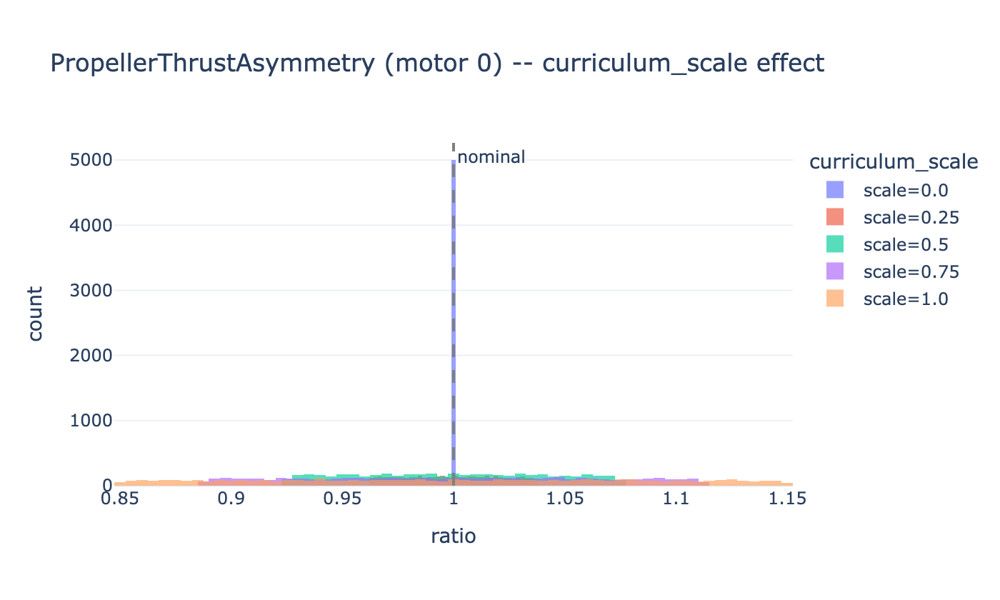

---

### Per-env diversity

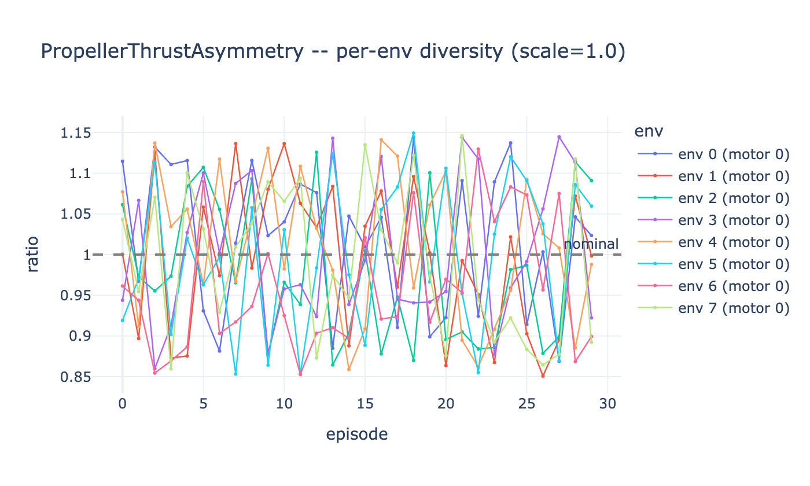

---

### Usage

```python
from genesis_robust_rl.perturbations.category_2_motor import PropellerThrustAsymmetry

asym = PropellerThrustAsymmetry(n_envs=512, dt=0.01)
asym.tick(is_reset=True)
asym.apply(scene, drone, env_state)
```

---

## 2.4 MotorPartialFailure

### Description

Per-motor efficiency fraction $\eta_i \in [0, 1]$ where 0 is full failure and 1 is nominal.
The reduced motor output is compensated by injecting a negative thrust delta as external force.

**Hook timing:** post_physics^1 (external force).

---

### Formal definition

$$
\Delta F_z = \sum_{i=1}^{4} (\eta_i - 1) \cdot K_{F,\text{nom}} \cdot \text{RPM}_i^2
$$

**Default config:** $\mathcal{D} = \text{Uniform}(0.3, 1.0)$, bounds $[0.0, 1.0]$,
nominal $= [1.0, 1.0, 1.0, 1.0]$, dimension $= (4,)$.

---

### Parameters

| Parameter | Type | Default | Description |
|---|---|---|---|
| `KF_nom` | float | `3.16e-10` | Nominal thrust coefficient |
| `distribution` | str | `"uniform"` | Sampling distribution |
| `distribution_params` | dict | `{"low": 0.3, "high": 1.0}` | Distribution parameters |
| `bounds` | tuple[float, float] | `(0.0, 1.0)` | Efficiency range [0=dead, 1=nominal] |
| `nominal` | list[float] | `[1.0, 1.0, 1.0, 1.0]` | Unperturbed efficiencies |
| `frequency` | str | `"per_episode"` | Resampling frequency |
| `lipschitz_k` | float\|None | `None` | Max change per step |

---

### Catalog reference

| Field | Value |
|---|---|
| `id` | `motor_partial_failure` |
| `catalog_ref` | 2.4 |
| `stateful` | no |
| `application_hook` | pre_physics (via external force) |
| `implementation` | `wrapper` -- `apply_links_external_force` |
| `feasibility_ref` | S6 |
| `risk` | low |
| `priority` | 1 |

---

### Curriculum scale effect

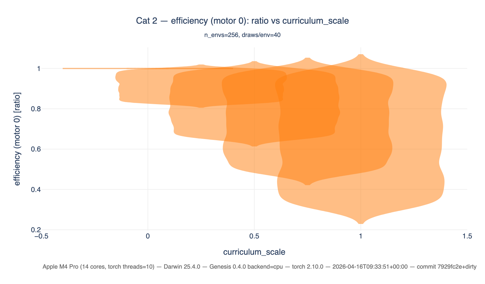

---

### Per-env diversity

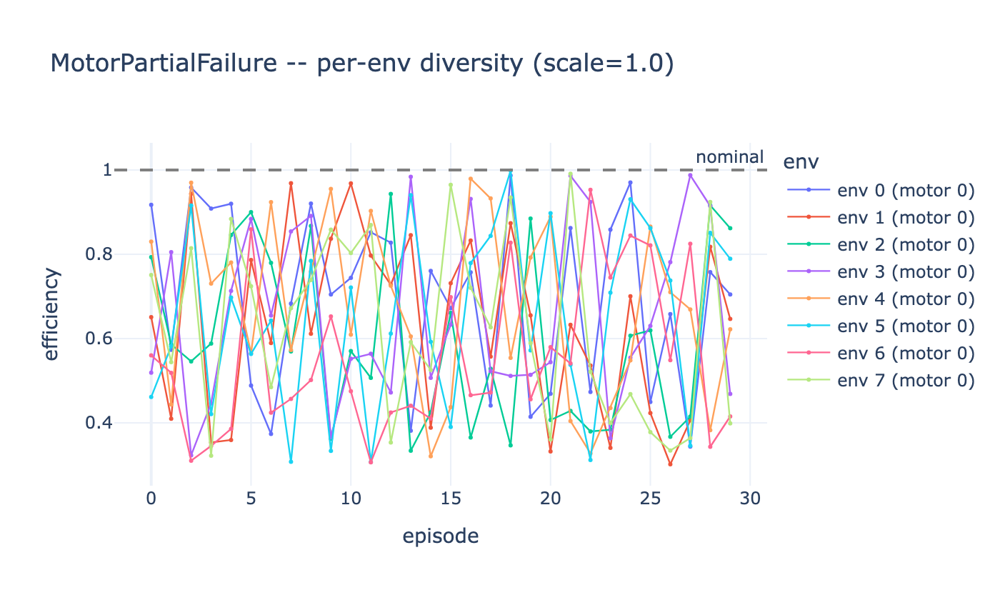

---

### Usage

```python
from genesis_robust_rl.perturbations.category_2_motor import MotorPartialFailure

fail = MotorPartialFailure(n_envs=512, dt=0.01)
fail.tick(is_reset=True)
fail.apply(scene, drone, env_state)
```

---

## 2.5 MotorKill

### Description

Binary motor kill mask -- randomly kills 0 to `max_killed` motors per env per episode.
Killed motors have their RPM zeroed. Custom `sample()` generates a binary mask
without using `_draw()`.

**Hook timing:** `on_action` (MotorCommandPerturbation) -- applied before thrust computation.

---

### Formal definition

At episode reset, for each environment:

1. Sample $n_\text{killed} \sim \text{U}[\text{min\_killed},\, \text{max\_killed}]$
   (scaled by `curriculum_scale`: effective max = $\text{min\_killed} + (\text{max\_killed} - \text{min\_killed}) \times s$)
2. Randomly select $n_\text{killed}$ motors to kill
3. Build binary mask $m \in \{0,1\}^4$ (1 = killed)

$$
\text{RPM}_\text{out} = \text{RPM}_\text{cmd} \odot (1 - m)
$$

---

### Parameters

| Parameter | Type | Default | Description |
|---|---|---|---|
| `min_killed` | int | `0` | Minimum killed motors per env |
| `max_killed` | int | `1` | Maximum killed motors per env |
| `frequency` | str | `"per_episode"` | Resampling frequency |
| `scope` | str | `"per_env"` | Independent per env |

---

### Catalog reference

| Field | Value |
|---|---|
| `id` | `motor_kill` |
| `catalog_ref` | 2.5 |
| `stateful` | no |
| `application_hook` | on_action (MotorCommandPerturbation) |
| `implementation` | `wrapper` -- RPM zeroing |
| `feasibility_ref` | S6 |
| `risk` | low |
| `priority` | 1 |

---

### Curriculum scale effect

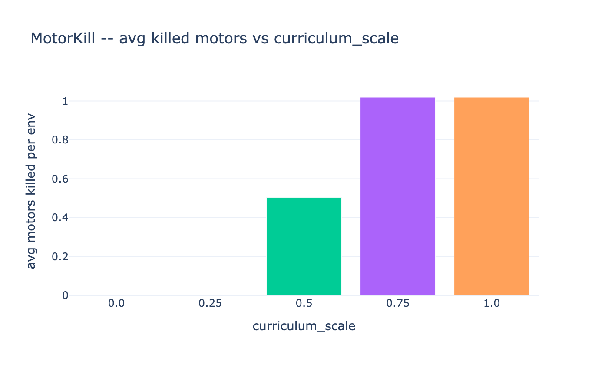

---

### Per-env diversity

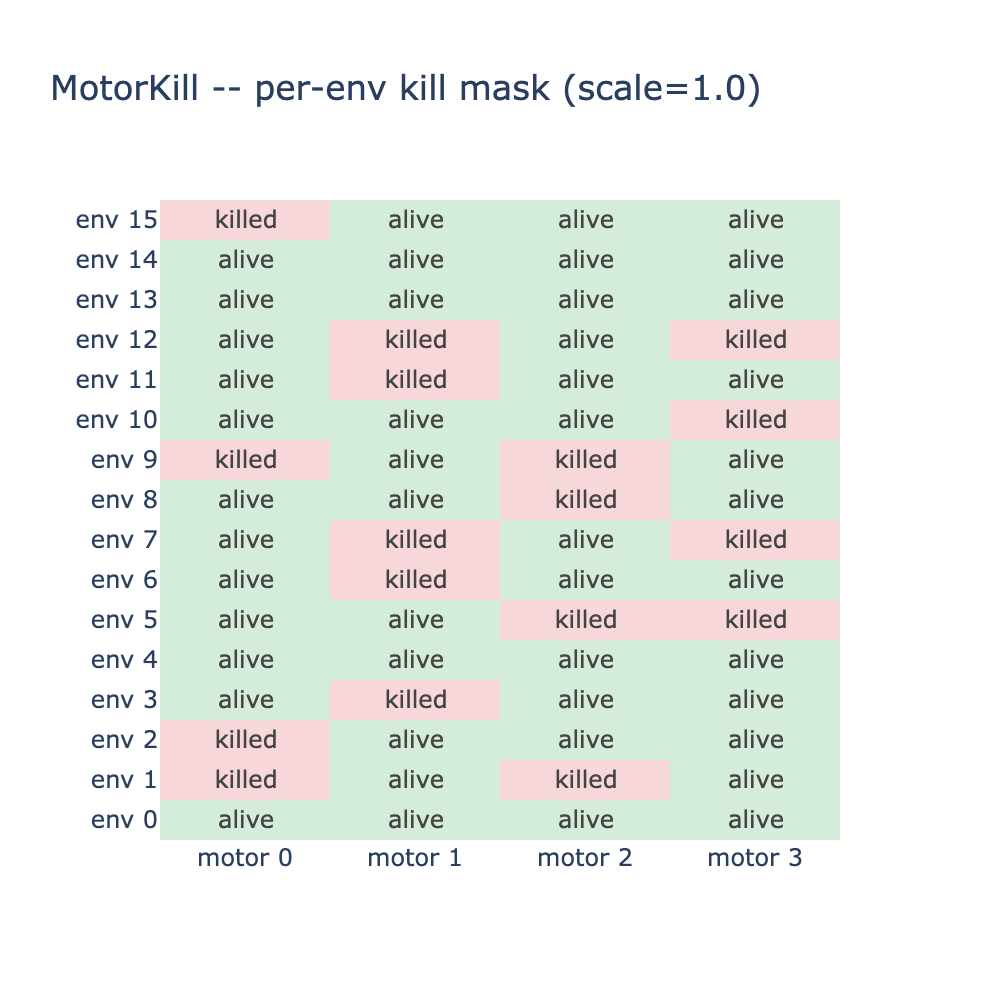

---

### Usage

```python
from genesis_robust_rl.perturbations.category_2_motor import MotorKill

kill = MotorKill(n_envs=512, dt=0.01, min_killed=0, max_killed=2)
kill.tick(is_reset=True)
rpm_out = kill.apply(rpm_cmd)  # zeroes killed motors
```

---

## 2.6 MotorLag

### Description

First-order IIR low-pass filter on RPM commands, modeling motor response dynamics.
The time constant $\tau$ is sampled per env at episode start. Internal state
`_rpm_actual` tracks the filtered output.

**Hook timing:** `on_action` (MotorCommandPerturbation).

---

### Formal definition

$$
\text{RPM}_\text{actual}(t) = \text{RPM}_\text{actual}(t-1) + \alpha \cdot \bigl(\text{RPM}_\text{cmd}(t) - \text{RPM}_\text{actual}(t-1)\bigr)
$$

where $\alpha = \min\bigl(\frac{dt}{\tau},\, 1\bigr)$ and $\tau$ is the motor time constant.

At reset, `_rpm_actual` is zeroed. Larger $\tau$ = slower response.

**Default config:** $\tau \sim \text{Uniform}(0.02, 0.05)$ s, bounds $[0.01, 0.1]$ s,
nominal $= 0.033$ s.

---

### Parameters

| Parameter | Type | Default | Description |
|---|---|---|---|
| `tau_nom` | float | `0.033` | Nominal time constant (s) |
| `distribution` | str | `"uniform"` | Sampling distribution |
| `distribution_params` | dict | `{"low": 0.02, "high": 0.05}` | Distribution parameters |
| `bounds` | tuple[float, float] | `(0.01, 0.1)` | Hard bounds on tau (s) |
| `nominal` | float | `0.033` | Unperturbed tau |
| `frequency` | str | `"per_episode"` | Tau resampled per episode |

---

### Catalog reference

| Field | Value |
|---|---|
| `id` | `motor_lag` |
| `catalog_ref` | 2.6 |
| `stateful` | **yes** -- `_rpm_actual: Tensor[n_envs, 4]` |
| `application_hook` | on_action (MotorCommandPerturbation) |
| `implementation` | `wrapper` |
| `feasibility_ref` | S6 |
| `risk` | low |
| `priority` | 1 |

---

### Curriculum scale effect

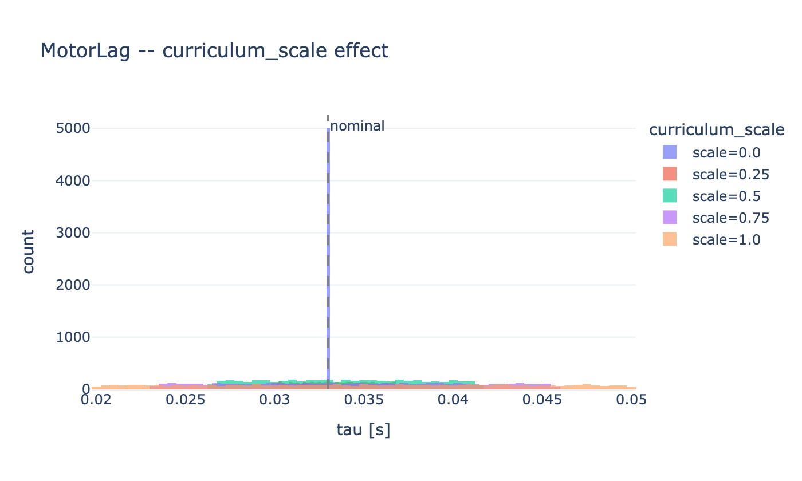

---

### Per-env diversity

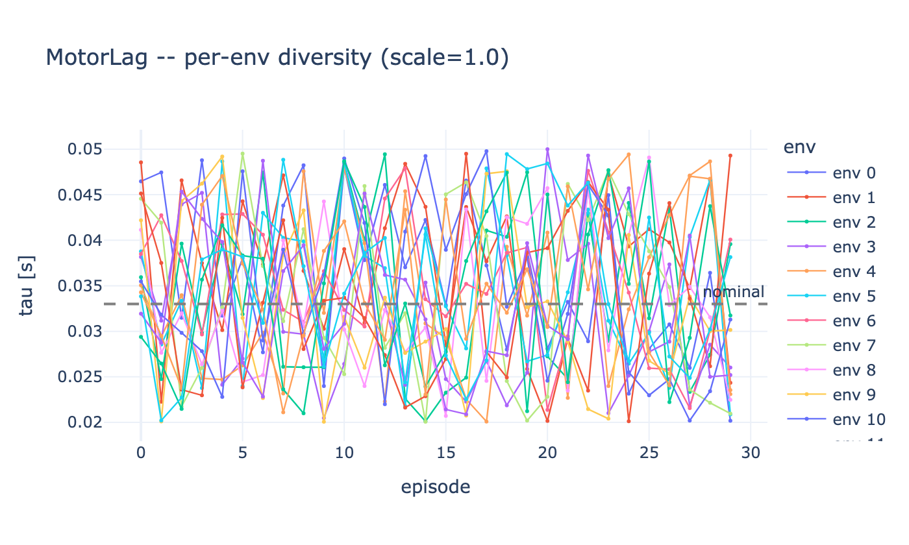

---

### Usage

```python
from genesis_robust_rl.perturbations.category_2_motor import MotorLag

lag = MotorLag(n_envs=512, dt=0.01)
lag.tick(is_reset=True)
rpm_out = lag.apply(rpm_cmd)  # filtered RPM
```

---

## 2.7 MotorRPMNoise

### Description

Multiplicative Gaussian noise on RPM commands. Each step, a noise scale is sampled per env,
then applied as: `rpm_out = rpm_cmd + randn * scale * rpm_cmd`.

**Hook timing:** `on_action` (MotorCommandPerturbation).

---

### Formal definition

$$
\text{RPM}_\text{out} = \text{RPM}_\text{cmd} + \epsilon \cdot \sigma \cdot \text{RPM}_\text{cmd}
$$

where $\epsilon \sim \mathcal{N}(0, I_{4})$ and $\sigma$ is the noise scale (per env, per motor),
resampled each step from $\text{Uniform}(0, 0.03)$, clipped to $[0, \text{noise\_frac\_max}]$.

**Default config:** `noise_frac_max=0.05`, distribution params $\{0, 0.03\}$.

---

### Parameters

| Parameter | Type | Default | Description |
|---|---|---|---|
| `noise_frac_max` | float | `0.05` | Maximum noise fraction of RPM |
| `distribution_params` | dict | `{"low": 0.0, "high": 0.03}` | Scale sampling range |
| `frequency` | str | `"per_step"` | Resampled every step |

---

### Catalog reference

| Field | Value |
|---|---|
| `id` | `motor_rpm_noise` |
| `catalog_ref` | 2.7 |
| `stateful` | no |
| `application_hook` | on_action (MotorCommandPerturbation) |
| `implementation` | `wrapper` |
| `feasibility_ref` | S6 |
| `risk` | low |
| `priority` | 2 |

---

### Curriculum scale effect

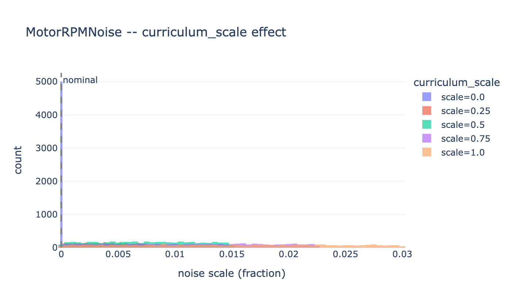

---

### Per-env diversity

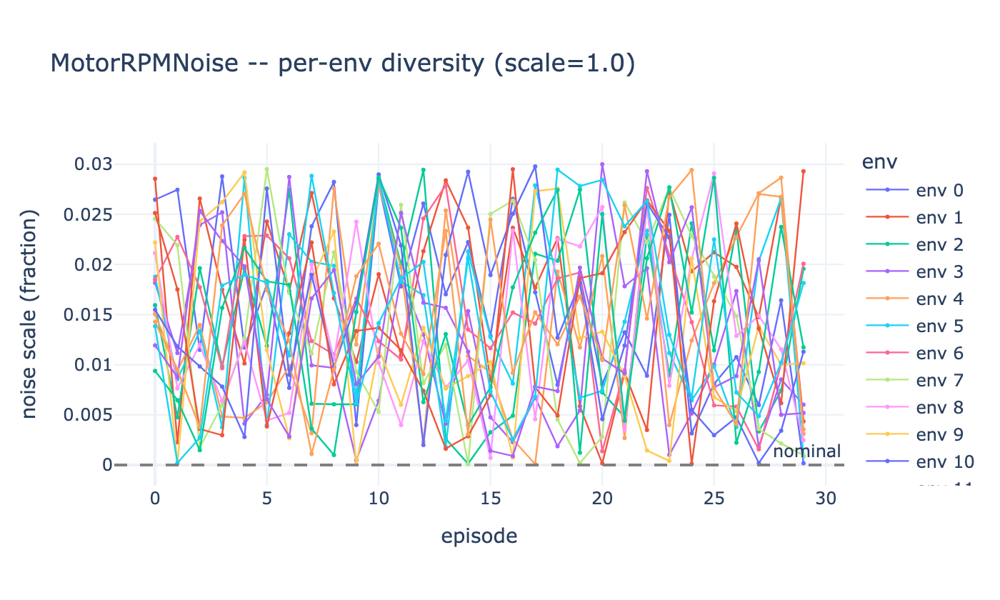

---

### Usage

```python
from genesis_robust_rl.perturbations.category_2_motor import MotorRPMNoise

noise = MotorRPMNoise(n_envs=512, dt=0.01, noise_frac_max=0.05)
noise.tick(is_reset=False)
rpm_out = noise.apply(rpm_cmd)
```

---

## 2.8 MotorSaturation

### Description

Hard RPM clamp at a per-env maximum. The saturation ceiling `rpm_max` is sampled per env
per episode, modeling degraded motor capacity.

**Hook timing:** `on_action` (MotorCommandPerturbation).

---

### Formal definition

$$
\text{RPM}_\text{out} = \text{clamp}(\text{RPM}_\text{cmd},\, 0,\, \text{rpm\_max})
$$

where $\text{rpm\_max}$ is sampled per env:

$$
\text{rpm\_max} \sim \text{Uniform}(0.8 \times R_\text{nom},\, R_\text{nom}), \quad \text{clipped to } [0.7 \times R_\text{nom},\, R_\text{nom}]
$$

**Default config:** $R_\text{nom} = 21666$ RPM (CF2X typical max).

---

### Parameters

| Parameter | Type | Default | Description |
|---|---|---|---|
| `rpm_max_nom` | float | `21666.0` | Nominal max RPM |
| `rpm_max_low_frac` | float | `0.7` | Lowest rpm_max as fraction of nominal |
| `distribution_params` | dict | `{"low": 17332.8, "high": 21666.0}` | Sampling range |
| `bounds` | tuple[float, float] | `(15166.2, 21666.0)` | Hard bounds |
| `frequency` | str | `"per_episode"` | Resampled per episode |

---

### Catalog reference

| Field | Value |
|---|---|
| `id` | `motor_saturation` |
| `catalog_ref` | 2.8 |
| `stateful` | no |
| `application_hook` | on_action (MotorCommandPerturbation) |
| `implementation` | `wrapper` |
| `feasibility_ref` | S6 |
| `risk` | low |
| `priority` | 2 |

---

### Curriculum scale effect

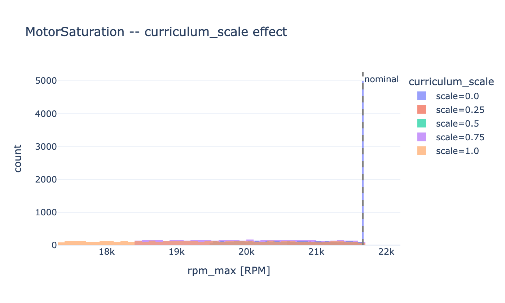

---

### Per-env diversity

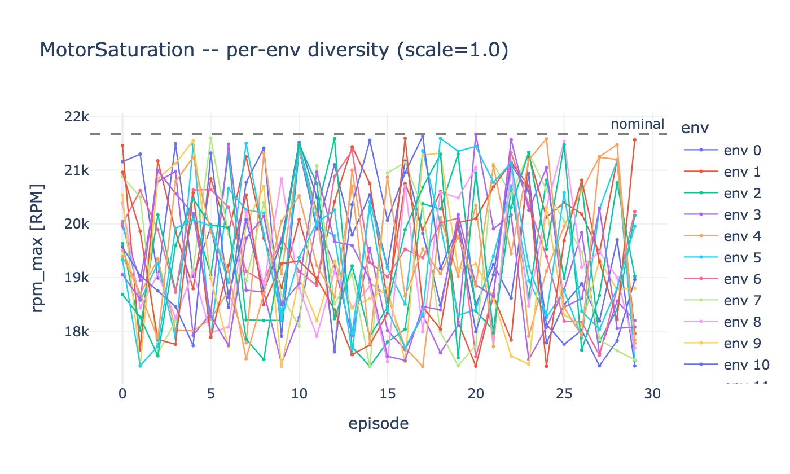

---

### Usage

```python
from genesis_robust_rl.perturbations.category_2_motor import MotorSaturation

sat = MotorSaturation(n_envs=512, dt=0.01, rpm_max_nom=21666.0)
sat.tick(is_reset=True)
rpm_out = sat.apply(rpm_cmd)  # clipped to per-env max
```

---

## 2.9 MotorWear

### Description

Models motor efficiency decay over an episode. Efficiency starts at 1.0 and decreases
monotonically each step at a per-motor rate sampled at reset. The RPM is scaled by
the current efficiency.

**Hook timing:** `on_action` (MotorCommandPerturbation).

---

### Formal definition

At reset:

$$
\eta_i = 1.0, \quad r_i \sim \text{Uniform}(r_\text{low}, r_\text{high}) \times s
$$

Each step:

$$
\eta_i(t) = \max\bigl(\eta_i(t-1) - r_i,\, 0.8\bigr)
$$

$$
\text{RPM}_\text{out} = \text{RPM}_\text{cmd} \odot \eta
$$

**Default config:** $r \sim \text{Uniform}(10^{-4}, 10^{-3})$, efficiency floor $= 0.8$.

---

### Parameters

| Parameter | Type | Default | Description |
|---|---|---|---|
| `distribution` | str | `"uniform"` | Distribution for decay rate |
| `distribution_params` | dict | `{"low": 0.0001, "high": 0.001}` | Decay rate range per step |
| `bounds` | tuple[float, float] | `(0.8, 1.0)` | Efficiency floor and ceiling |
| `nominal` | float | `1.0` | Unperturbed efficiency |
| `frequency` | str | `"per_step"` | State evolves per step |

---

### Catalog reference

| Field | Value |
|---|---|
| `id` | `motor_wear` |
| `catalog_ref` | 2.9 |
| `stateful` | **yes** -- `_efficiency: Tensor[n_envs, 4]`, `_rate: Tensor[n_envs, 4]` |
| `application_hook` | on_action (MotorCommandPerturbation) |
| `implementation` | `wrapper` -- KF scaling via efficiency |
| `feasibility_ref` | S6 |
| `risk` | low |
| `priority` | 2 |

---

### Curriculum scale effect

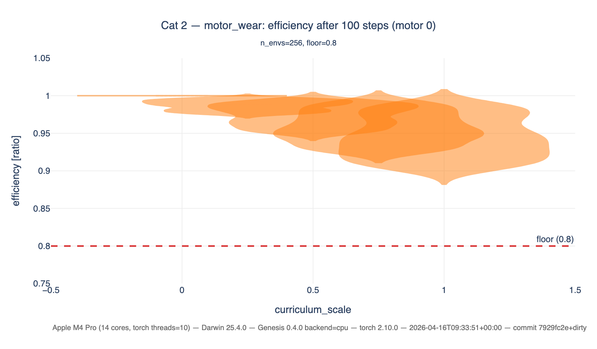

---

### Per-env diversity (state evolution)

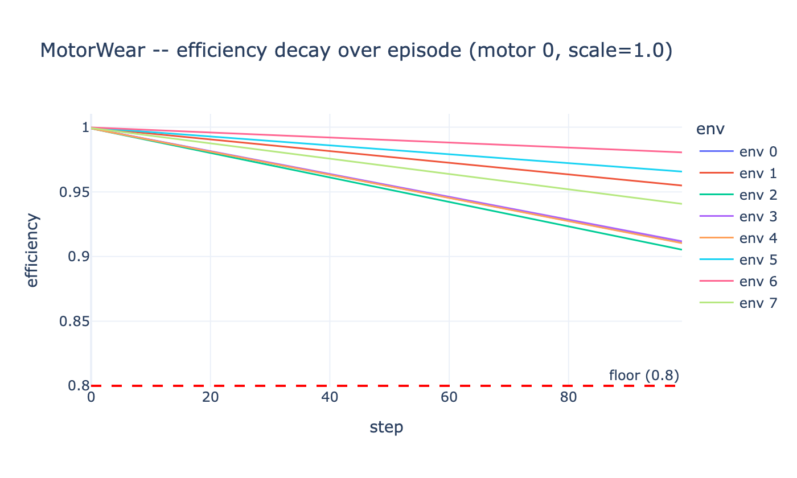

---

### Usage

```python
from genesis_robust_rl.perturbations.category_2_motor import MotorWear

wear = MotorWear(n_envs=512, dt=0.01)
wear.tick(is_reset=True)
for step in range(100):
    wear.step()
    rpm_out = wear.apply(rpm_cmd)
```

---

## 2.10 RotorImbalance

### Description

Models vibration from unbalanced propellers as sinusoidal RPM modulation.
The phase advances each step proportional to the current RPM, creating
a frequency-dependent vibration pattern. Exposes `imu_noise_amplitude` for
Cat 4 sensor coupling.

**Hook timing:** `on_action` (MotorCommandPerturbation).

---

### Formal definition

At reset: sample magnitude $A_i$ per motor, randomize phase $\phi_i$.

Each step: advance phase $\phi_i(t) = \phi_i(t-1) + \omega_i \cdot dt$ where $\omega_i = \text{RPM}_i \cdot 2\pi/60$.

$$
\text{RPM}_\text{out} = \text{RPM}_\text{cmd} \odot \bigl(1 + A \cdot \sin(\phi)\bigr)
$$

**Default config:** $A \sim \text{Uniform}(0, 0.03)$, bounds $[0, 0.05]$, nominal $= 0$.

---

### Parameters

| Parameter | Type | Default | Description |
|---|---|---|---|
| `distribution` | str | `"uniform"` | Distribution for imbalance magnitude |
| `distribution_params` | dict | `{"low": 0.0, "high": 0.03}` | Magnitude sampling range |
| `bounds` | tuple[float, float] | `(0.0, 0.05)` | Hard bounds on magnitude |
| `nominal` | float | `0.0` | Unperturbed (no imbalance) |
| `frequency` | str | `"per_step"` | State evolves per step |

---

### Catalog reference

| Field | Value |
|---|---|
| `id` | `rotor_imbalance` |
| `catalog_ref` | 2.10 |
| `stateful` | **yes** -- `_phase: Tensor[n_envs, 4]`, `_magnitude: Tensor[n_envs, 4]` |
| `application_hook` | on_action (MotorCommandPerturbation) |
| `implementation` | `wrapper` -- sinusoidal modulation |
| `feasibility_ref` | S2, S6 |
| `risk` | medium |
| `priority` | 3 |

---

### Curriculum scale effect

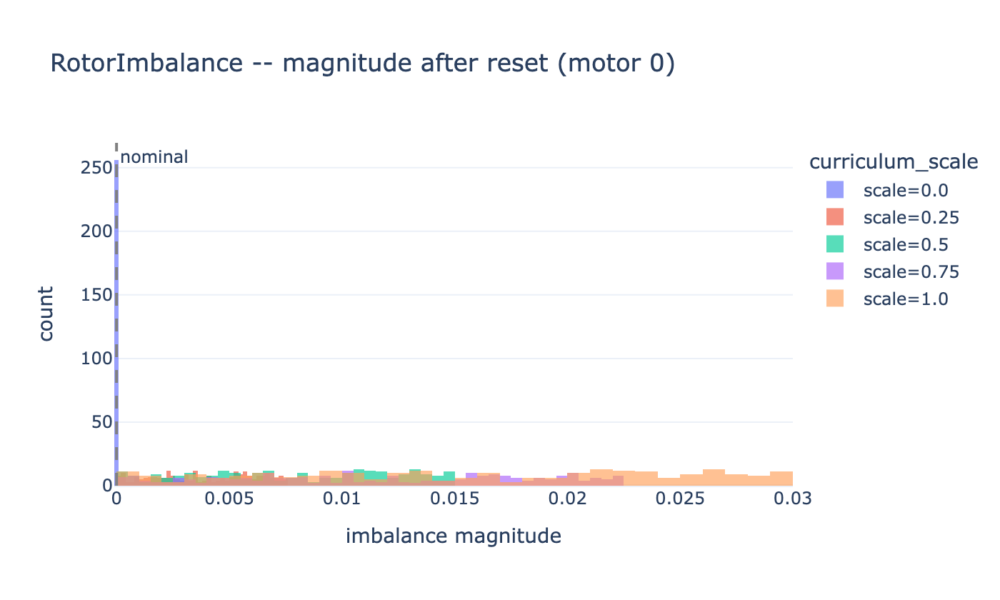

---

### Per-env diversity

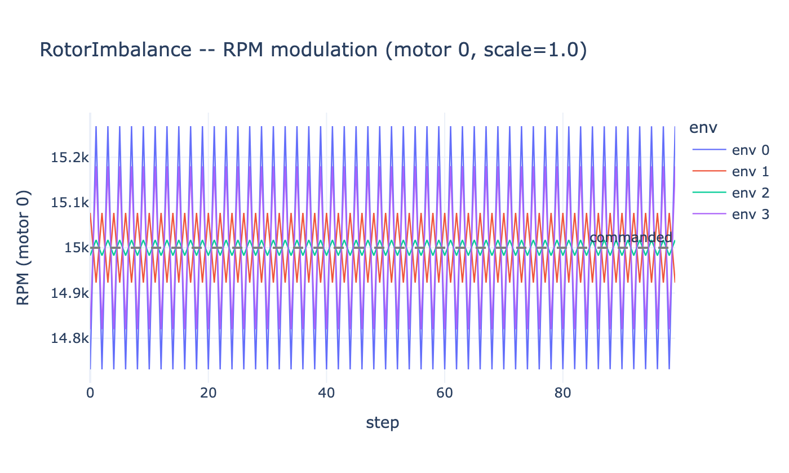

---

### Usage

```python
from genesis_robust_rl.perturbations.category_2_motor import RotorImbalance

imbal = RotorImbalance(n_envs=512, dt=0.01)
imbal.tick(is_reset=True)
for step in range(100):
    imbal.step()
    rpm_out = imbal.apply(rpm_cmd)
    vibration = imbal.imu_noise_amplitude  # for Cat 4 coupling
```

---

## 2.11 MotorBackEMF

### Description

Models the back-EMF braking torque from motor windings. Each motor generates a brake
torque proportional to $K_e^2 \cdot \omega / R$. The perturbation injects only the delta
between perturbed and nominal $K_e$ values.

**Hook timing:** post_physics^1 (external torque).

---

### Formal definition

$$
\omega_i = \text{RPM}_i \cdot \frac{2\pi}{60}
$$

$$
\Delta \tau_z = \sum_{i=1}^{4} s_i \cdot \frac{K_{e,\text{pert}}^2 - K_{e,\text{nom}}^2}{R} \cdot \omega_i
$$

where $s_i$ is the spin sign and $R$ is the motor winding resistance.

**Default config:** $K_e \sim \text{Uniform}(0.007, 0.013)$ V.s/rad,
bounds $[0.005, 0.015]$, nominal $= 0.01$, $R = 1.0\,\Omega$.

---

### Parameters

| Parameter | Type | Default | Description |
|---|---|---|---|
| `Ke_nom` | float | `0.01` | Nominal back-EMF constant (V.s/rad) |
| `R_motor` | float | `1.0` | Motor winding resistance (ohm) |
| `spin_signs` | list[float] | `[1, -1, 1, -1]` | CW/CCW propeller signs |
| `distribution` | str | `"uniform"` | Sampling distribution |
| `distribution_params` | dict | `{"low": 0.007, "high": 0.013}` | Distribution parameters |
| `bounds` | tuple[float, float] | `(0.005, 0.015)` | Hard bounds on Ke |
| `nominal` | float | `0.01` | Unperturbed Ke |
| `frequency` | str | `"per_step"` | Resampling frequency |

---

### Catalog reference

| Field | Value |
|---|---|
| `id` | `motor_back_emf` |
| `catalog_ref` | 2.11 |
| `stateful` | no |
| `application_hook` | pre_physics (via external torque) |
| `implementation` | `wrapper` -- `apply_links_external_torque` |
| `feasibility_ref` | S6 |
| `risk` | medium |
| `priority` | 3 |

---

### Curriculum scale effect

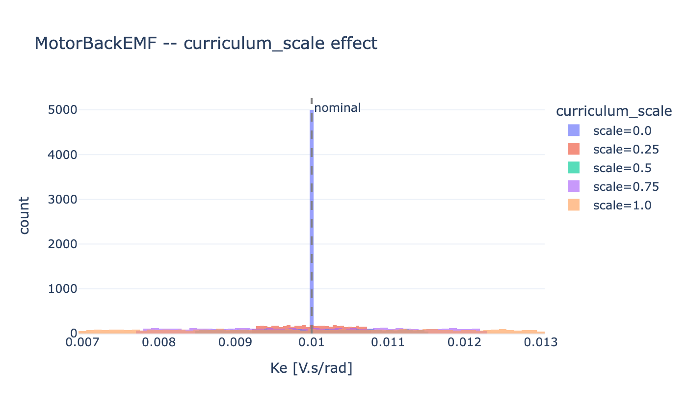

---

### Per-env diversity

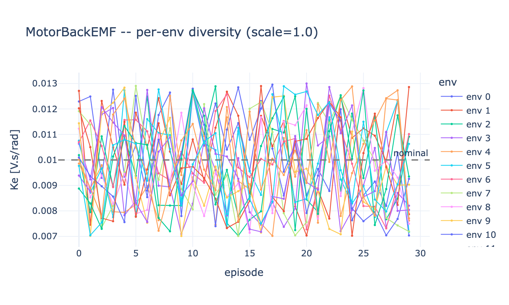

---

### Usage

```python
from genesis_robust_rl.perturbations.category_2_motor import MotorBackEMF

emf = MotorBackEMF(n_envs=512, dt=0.01)
emf.tick(is_reset=True)
emf.apply(scene, drone, env_state)
```

---

### Genesis API note

Uses `scene.rigid_solver.apply_links_external_torque()`. Requires BLDC motor parameters
($K_e$ and $R$) which are not available from URDF -- must be configured explicitly.

---

## 2.12 MotorColdStart

### Description

Models cold motor behavior where the effective thrust coefficient is initially higher
than nominal (friction, cogging) and decays exponentially to 1.0 as the motor warms up.
The RPM is scaled by the warmup factor.

**Hook timing:** `on_action` (MotorCommandPerturbation).

---

### Formal definition

At reset: sample initial overhead $h_i$ per motor.

$$
f_i(t) = 1 + (h_i - 1) \cdot e^{-t/\tau_w}
$$

$$
\text{RPM}_\text{out} = \text{RPM}_\text{cmd} \odot f
$$

In the implementation, `step()` applies: $f \leftarrow 1 + (f - 1) \cdot e^{-dt/\tau_w}$.

**Default config:** $h \sim \text{Uniform}(1.0, 1.3)$, bounds $[1.0, 1.5]$,
$\tau_w = 0.5$ s.

---

### Parameters

| Parameter | Type | Default | Description |
|---|---|---|---|
| `warmup_tau` | float | `0.5` | Warmup time constant (s) |
| `distribution` | str | `"uniform"` | Distribution for initial overhead |
| `distribution_params` | dict | `{"low": 1.0, "high": 1.3}` | Initial overhead sampling range |
| `bounds` | tuple[float, float] | `(1.0, 1.5)` | Hard bounds on overhead factor |
| `nominal` | float | `1.0` | No overhead (warm motor) |
| `frequency` | str | `"per_episode"` | Overhead sampled per episode |

---

### Catalog reference

| Field | Value |
|---|---|
| `id` | `motor_cold_start` |
| `catalog_ref` | 2.12 |
| `stateful` | **yes** -- `_warmup_factor: Tensor[n_envs, 4]`, `_initial_overhead: Tensor[n_envs, 4]` |
| `application_hook` | on_action (MotorCommandPerturbation) |
| `implementation` | `wrapper` |
| `feasibility_ref` | S6 |
| `risk` | low |
| `priority` | 3 |

---

### Curriculum scale effect

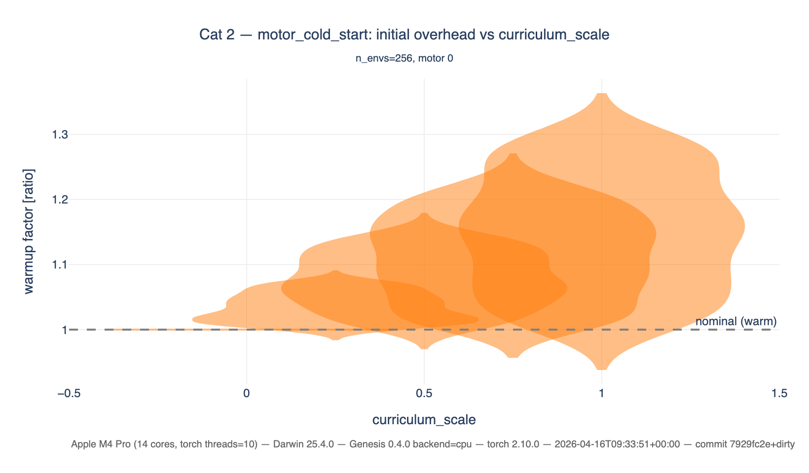

---

### Per-env diversity (state evolution)

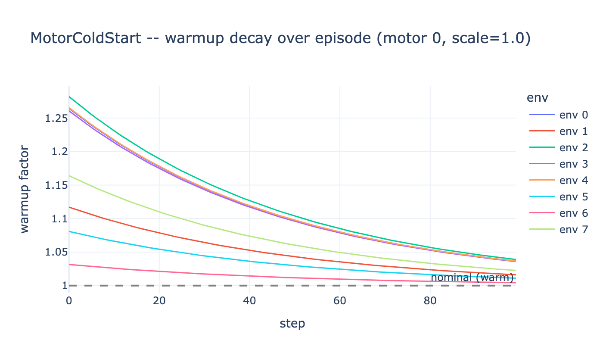

---

### Usage

```python
from genesis_robust_rl.perturbations.category_2_motor import MotorColdStart

cold = MotorColdStart(n_envs=512, dt=0.01, warmup_tau=0.5)
cold.tick(is_reset=True)
for step in range(100):
    cold.step()
    rpm_out = cold.apply(rpm_cmd)
```

---

## 2.13 GyroscopicEffect

### Description

Models gyroscopic precession torque from spinning rotors. The torque arises from the
cross product of the rotor angular momentum and the body angular velocity.
Only the delta between perturbed and nominal rotor inertia is injected.

**Hook timing:** post_physics^1 (external torque).

---

### Formal definition

$$
\Omega_\text{net} = \sum_{i=1}^{4} s_i \cdot \omega_{\text{rotor},i}
$$

$$
\vec{\tau}_\text{gyro} = \Delta I_\text{rotor} \cdot \Omega_\text{net} \cdot (\hat{z} \times \vec{\omega}_\text{body})
$$

where $\hat{z} \times \vec{\omega}_\text{body} = [-\omega_y, \omega_x, 0]$
and $\Delta I_\text{rotor} = I_{\text{rotor,pert}} - I_{\text{rotor,nom}}$.

**Default config:** $I_\text{rotor} \sim \text{Uniform}(2 \times 10^{-5}, 4 \times 10^{-5})$ kg.m^2,
bounds $[1.5 \times 10^{-5}, 4.5 \times 10^{-5}]$, nominal $= 3 \times 10^{-5}$.

---

### Parameters

| Parameter | Type | Default | Description |
|---|---|---|---|
| `I_rotor_nom` | float | `3.0e-5` | Nominal rotor inertia (kg.m^2) |
| `spin_signs` | list[float] | `[1, -1, 1, -1]` | CW/CCW propeller signs |
| `distribution` | str | `"uniform"` | Sampling distribution |
| `distribution_params` | dict | `{"low": 2.0e-5, "high": 4.0e-5}` | Distribution parameters |
| `bounds` | tuple[float, float] | `(1.5e-5, 4.5e-5)` | Hard bounds on I_rotor |
| `nominal` | float | `3.0e-5` | Unperturbed rotor inertia |
| `frequency` | str | `"per_episode"` | Resampled per episode |
| `lipschitz_k` | float\|None | `None` | Max change per step |

---

### Catalog reference

| Field | Value |
|---|---|
| `id` | `gyroscopic_effect` |
| `catalog_ref` | 2.13 |
| `stateful` | no |
| `application_hook` | pre_physics (via external torque) |
| `implementation` | `wrapper` -- `apply_links_external_torque` |
| `feasibility_ref` | S2 |
| `risk` | medium |
| `priority` | 3 |

---

### Curriculum scale effect

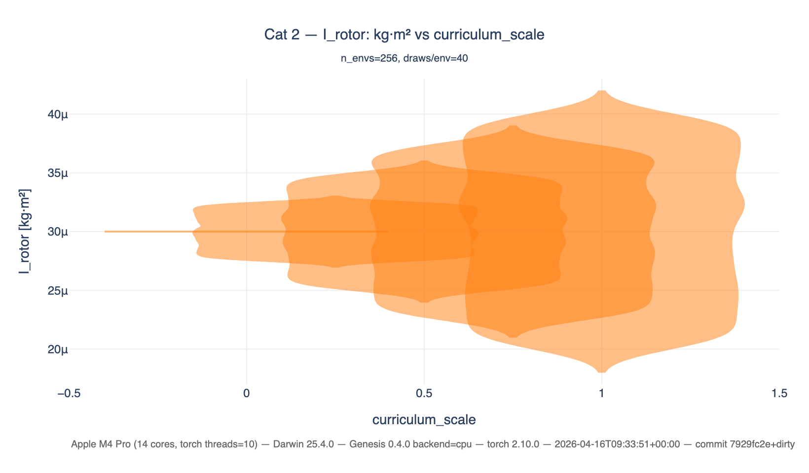

---

### Per-env diversity

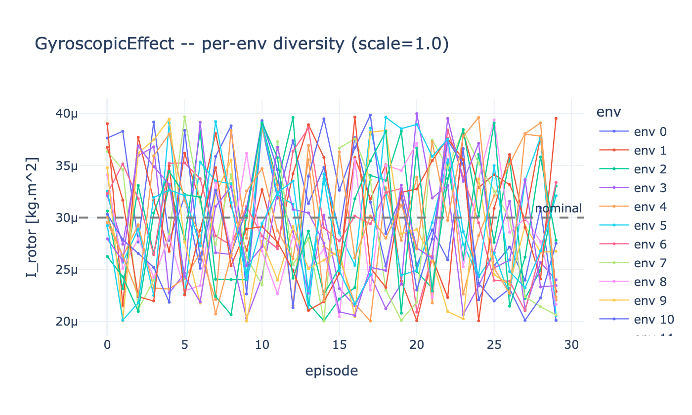

---

### Usage

```python
from genesis_robust_rl.perturbations.category_2_motor import GyroscopicEffect

gyro = GyroscopicEffect(n_envs=512, dt=0.01)
gyro.tick(is_reset=True)
gyro.apply(scene, drone, env_state)
```

---

### Genesis API note

Uses `scene.rigid_solver.apply_links_external_torque()`. The gyroscopic torque has
X and Y components (unlike KM and back-EMF which are Z-only), arising from the cross
product $\hat{z} \times \vec{\omega}_\text{body}$.
